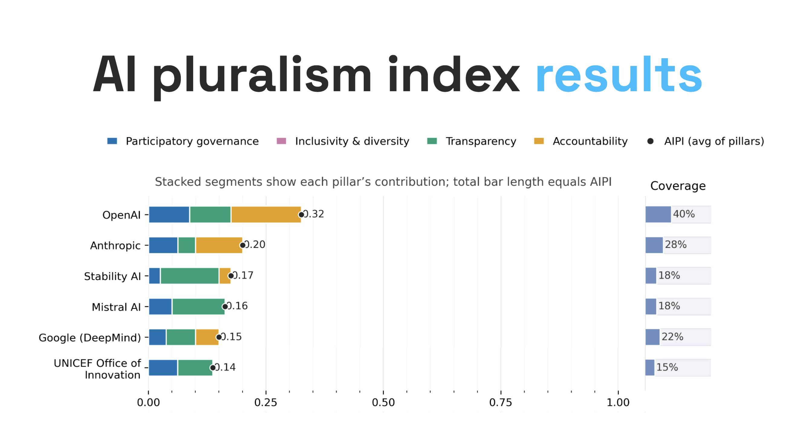

*A public framework for evaluating not just what AI systems can do, but who gets a say in how they are built and governed.*

[Read on arXiv](https://arxiv.org/abs/2510.08193) · [Explore the Index](https://aipluralism.wiki/) · [View Code](https://github.com/rsdmu/aipi-pluralism-index)

## Why This Matters

AI systems increasingly shape what people see, know, and decide. Yet most public debate still revolves around capability: which model is faster, stronger, or more accurate. That matters. It is also incomplete.

The harder question is governance. Who gets to shape an AI system's goals, safeguards, data practices, and deployment? Who can inspect it, challenge it, or understand how decisions are made? As leading systems converge on performance for everyday tasks, those questions become harder to ignore.

## The Question

I built the **AI Pluralism Index (AIPI)** around a simple question that most benchmarks ignore:

> Not only what can AI do, but who gets to shape it?

AIPI evaluates whether AI systems and providers are governed in ways that are meaningfully participatory, inclusive, transparent, and accountable. It does not reward vague claims. It scores only what leaves public, auditable traces.

## What AIPI Measures

The framework is organized around four pillars:

- **Participatory governance** asks whether affected stakeholders can influence decisions rather than merely comment on them after the fact.
- **Inclusivity and diversity** examine who is represented in design, evaluation, access, and support, including language access and accessibility.
- **Transparency** asks whether the public can actually inspect the documentation needed to understand a system's purpose, provenance, limits, and governance.
- **Accountability** looks for the mechanisms that make harms, failures, and remedies visible, from disclosure processes to audits, redress, and incident handling.

Taken together, the four pillars shift attention away from model performance alone and toward the social and institutional conditions under which AI is built and used.

## How I Score It

AIPI is evidence-based by design. It codes only verifiable public artifacts such as model and system cards, governance records, release notes, audits, policy documents, and external evaluations.

The framework reports two complementary views of each score. A **lower-bound evidence score** treats undocumented claims conservatively. A **known-only score** shows how a provider performs on the indicators where evidence exists. Coverage is reported alongside both, so missing documentation stays visible instead of disappearing inside a single number.

That distinction matters because governance is often documented unevenly. A system can look responsible on paper simply because the difficult questions were never made public. AIPI makes that gap legible.

## Why This Matters in Practice

I designed the index for real decisions, not just theory.

For **policymakers and regulators**, it offers an auditable way to turn broad principles into concrete evidence checks. For **procurers**, it provides a basis for comparing vendors beyond benchmark scores and marketing language. For **researchers and journalists**, it creates a reproducible method for testing whether public claims about responsible AI are supported by observable practice. For **the public**, it opens a conversation that is too often hidden behind technical performance metrics.

## Visual

*Overview of the AI Pluralism Index and its evidence-based governance pillars.*

## What Comes Next

AIPI is not meant to be a static ranking. I designed it as an open, versioned, community-governed framework with public adjudication, evidence tracking, and room for challenge and revision.

The broader aim is to change incentives. If AI providers know they will be compared not only on what their systems can do, but on how answerable and pluralistic their governance is, then transparency, participation, and accountability become harder to treat as optional.

**More:** [arXiv](https://arxiv.org/abs/2510.08193) · [AI Pluralism Index](https://aipluralism.wiki/) · [GitHub](https://github.com/rsdmu/aipi-pluralism-index)

*Tags: AI Governance · Pluralism · Accountability · Transparency · Participation · Responsible AI*
