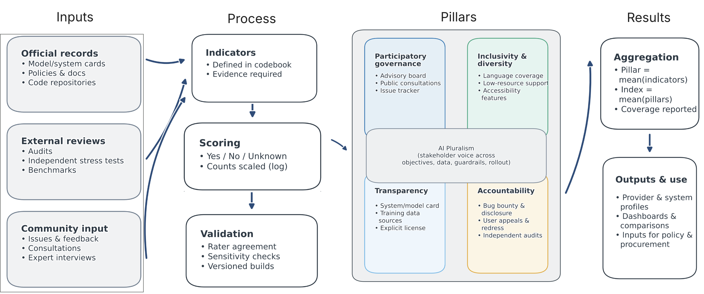

*The AI Pluralism Index asks a public question: who gets a say in how AI systems are built and governed (Mushkani, 2026).*

[Read on arXiv](https://arxiv.org/abs/2510.08193) · [Explore the Index](https://aipluralism.wiki/) · [View Code](https://github.com/rsdmu/aipi-pluralism-index)

## Why This Index

AI systems now shape what people see, know, buy, trust, and contest, yet most public comparison still stops at capability: speed, fluency, benchmark scores, and price. Those measures matter, but they leave out another question: who gets to shape the goals, safeguards, data practices, and deployment rules of the systems themselves.

That gap is what the **AI Pluralism Index (AIPI)** is designed to confront. I built it as a framework for asking not only what AI can do, but who can influence it, inspect it, challenge it, and hold it to account when it fails.

## What It Measures

AIPI is organized around four pillars: **participatory governance**, **inclusivity and diversity**, **transparency**, and **accountability**. Together, those pillars shift attention away from performance alone and toward the social conditions under which a system is built and used.

- **Participatory governance** asks whether affected stakeholders can influence decisions rather than merely comment after the fact.
- **Inclusivity and diversity** asks who is represented in design, evaluation, access, and support.
- **Transparency** asks whether the public can actually inspect the documentation needed to understand a system's purpose, limits, and governance.
- **Accountability** asks whether harms, failures, and remedies are visible and contestable.

The index does not reward aspirational language on its own. It scores what can be substantiated through public artifacts such as model and system cards, governance records, audits, release notes, policy documents, and external evaluations.

## How The Scoring Works

One design choice is to make missing evidence visible instead of smoothing it away. A **lower-bound evidence score** treats undocumented claims conservatively. A **known-only score** reports performance only where evidence exists. Coverage is shown alongside both, so weak documentation remains part of the story instead of disappearing inside a single headline number (Mushkani, 2026).

That distinction matters because governance is often documented unevenly. A provider can appear responsible simply because the hardest questions were never made public. AIPI is designed to make that gap visible.

## Why It Matters In Practice

I designed the index for use, not just theory. For policymakers and regulators, it turns broad principles into auditable checks. For procurement teams, it offers a way to compare systems beyond benchmark performance and brand language. For researchers and journalists, it creates a reproducible method for testing whether public claims about responsible AI are backed by public evidence.

The larger aim is cultural as much as technical. If providers know they will be compared not only on capability but also on whether their governance is participatory, transparent, and answerable, those qualities become harder to treat as optional extras.

## Visual

*Overview of the AIPI framework.*

## What Comes Next

The paper describes AIPI as an open, versioned system with public evidence tracking and room for revision as governance practices change. The point is not to freeze judgment. It is to make judgment inspectable.

**More:** [arXiv](https://arxiv.org/abs/2510.08193) · [AI Pluralism Index](https://aipluralism.wiki/) · [GitHub](https://github.com/rsdmu/aipi-pluralism-index)

## References

Mushkani, R. (2026). *Measuring what matters: The AI Pluralism Index*. arXiv. https://arxiv.org/abs/2510.08193v3
