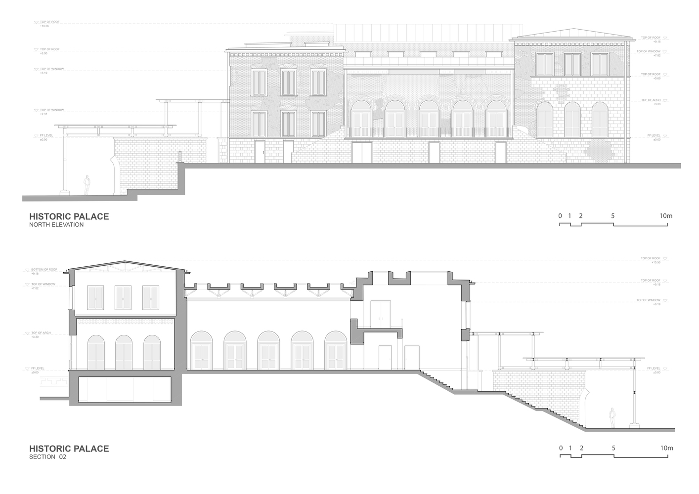
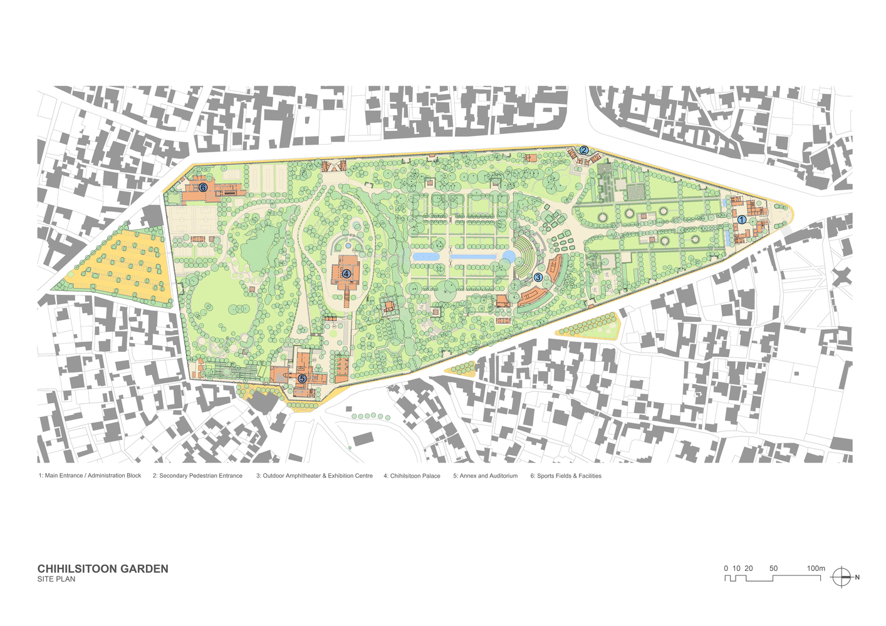
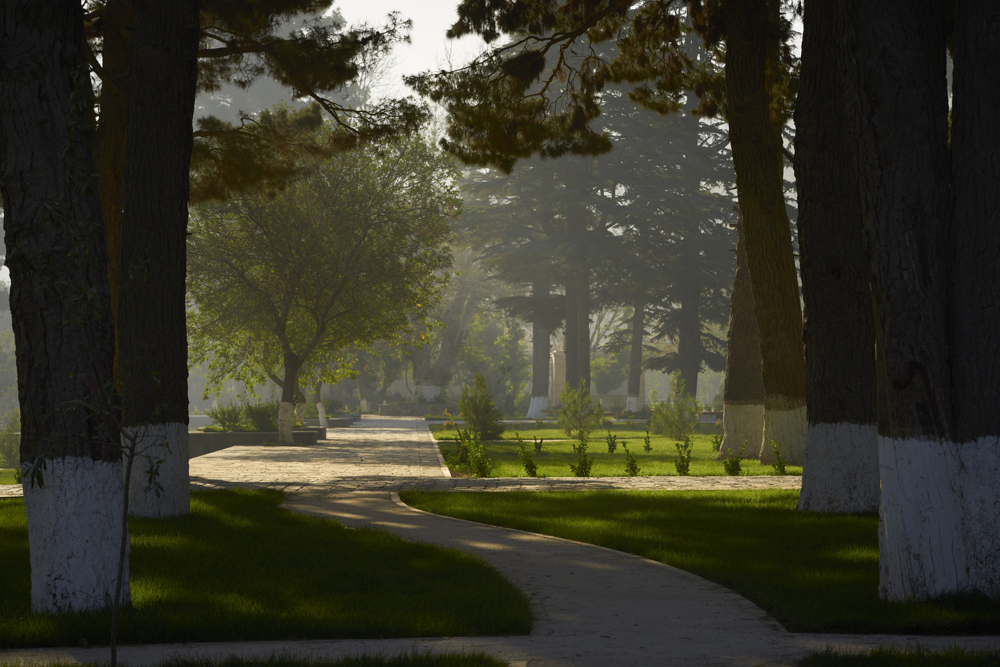
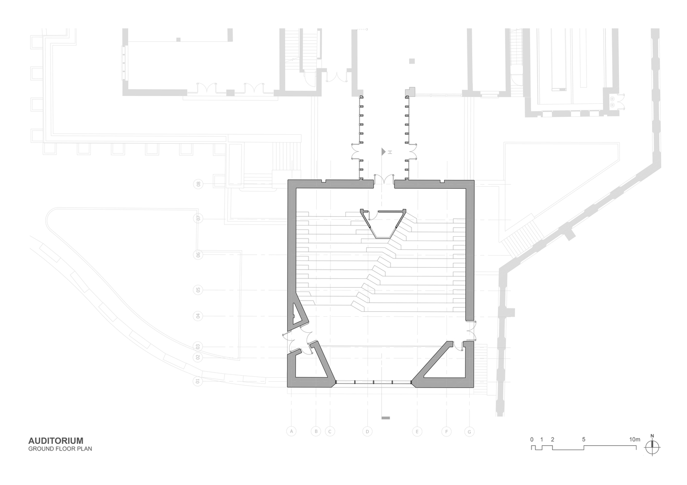
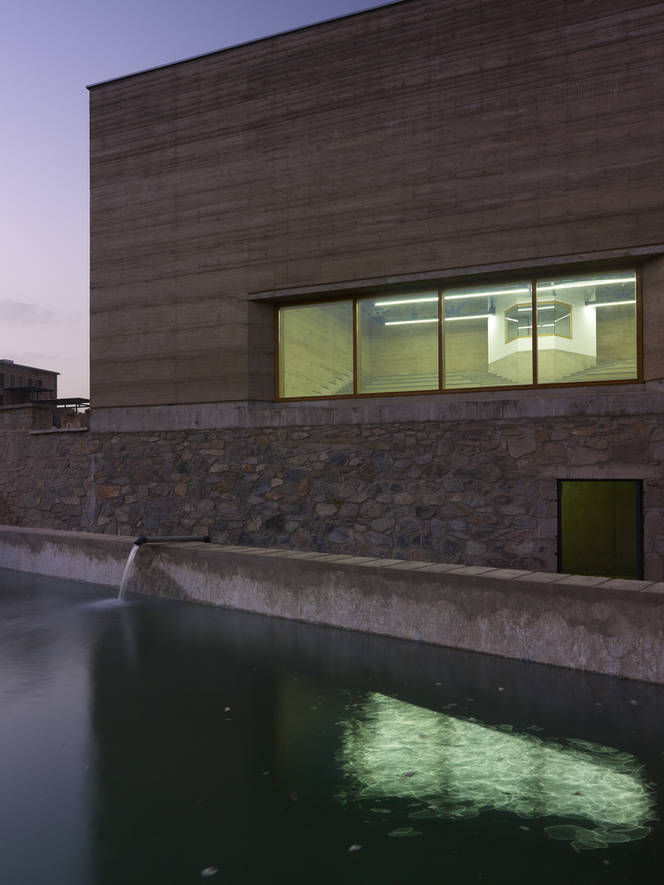
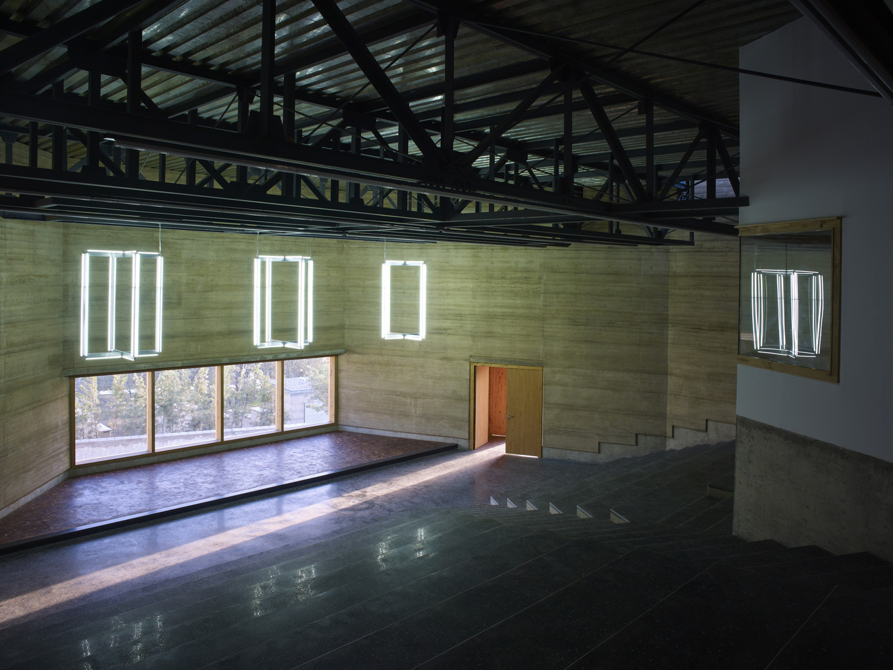

*Photograph of Chihilsitoon Garden in Kabul.*

**Project team:** Ajmal Maiwandi, Sekandar Seradj, Rashid Mushkani, Farhad Alawi, Rizaq Batoor, Shahwali Ghaznawi, Ayaz Hosham, Firoz Jami, Khalid Khan, Abdullah Mahmood, Koukaba Mojadidi, Shahab Mushref, Naweed Nahel, Nehmat Nayab, Ikram Rahimzay, Abdullah Safi, Shaiq Sarwari, Omid Shams, Najib Stanikzay, Waris Qaimizada, Mustafa Ahmadi, Mustafa Asghari, Shafiq Furqani, Basir Langari, Hamid Rahimi, Wahidullah Sabawoon, Tahir Shafaq, Waheed Stanikzai, Naeem Wahidi, Ertugrul Erbay, Arash Boostani.

## Project Overview

The **Chihilsitoon Garden Project** in Kabul, Afghanistan, restored and updated the historic Chihilsitoon Garden by adding new rammed earth buildings, sports areas, and commercial spaces while preserving its cultural heritage. The architecture uses materials suited to the local climate and integrates modern facilities with the garden's traditional elements. Sustainable methods, such as efficient water management and eco-friendly construction, were implemented to ensure long-term maintenance. The project involved working with local authorities and the community to create a space that meets public needs and supports ongoing upkeep through revenue-generating facilities.

## Visual Documentation

  

    
    

      
Facade and Elevation of the Chihilsitoon Palace.

    

  

  

    
    

      
Chihilsitoon Garden Site Plan.

    

  

  

    
    

      
Public spaces within the Chihilsitoon Garden.

    

  

  

    
    

      
Floor plan of the auditorium in Chihilsitoon Garden.

    

  

  

    
    

      
Facade of the Auditorium in Chihilsitoon Garden.

    

  

  

    
    

      
Facade of the Auditorium in Chihilsitoon Garden.

    

  

## Related Links

- [Full Project on ArchDaily](https://www.archdaily.com/911456/chihilsitoon-garden-project-aga-khan-trust-for-culture)
- [Aga Khan Trust for Culture](https://www.akdn.org/our-agencies/aga-khan-trust-culture)

## Tags

  Urban Design
  Public Space
  Sustainability
  Restoration
  Architecture

  Urban Regeneration
  Adaptive Reuse
  Economic Development
  Historic Preservation
  Public Spaces

