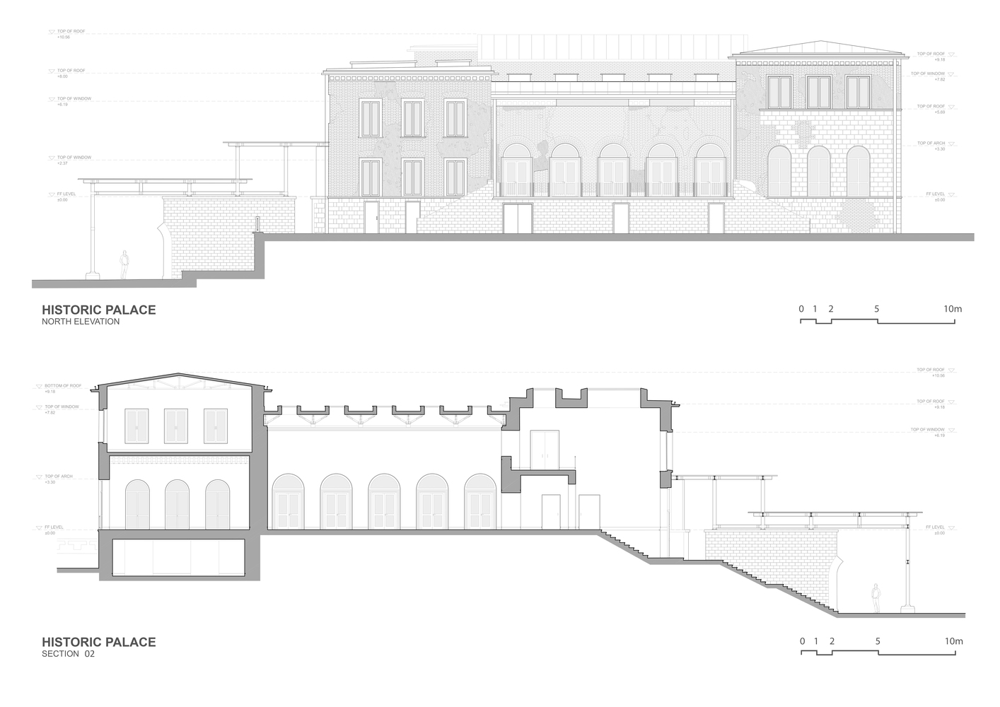
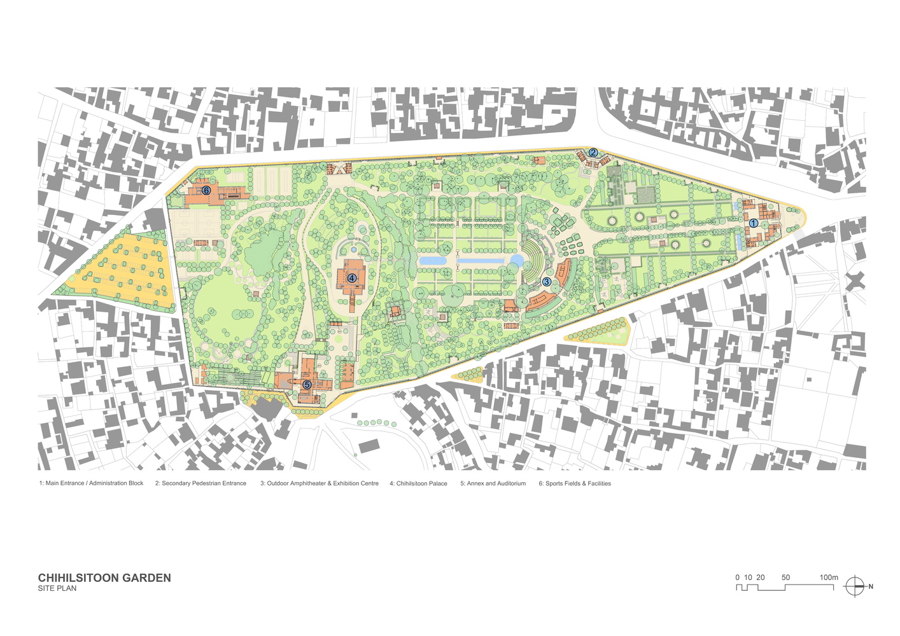
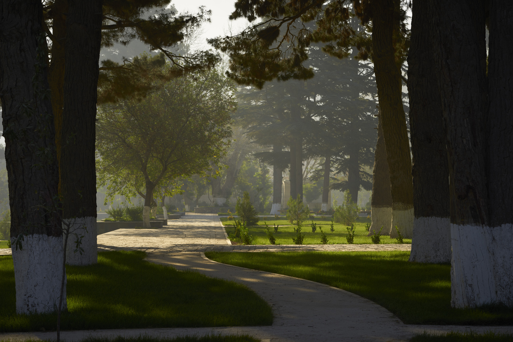
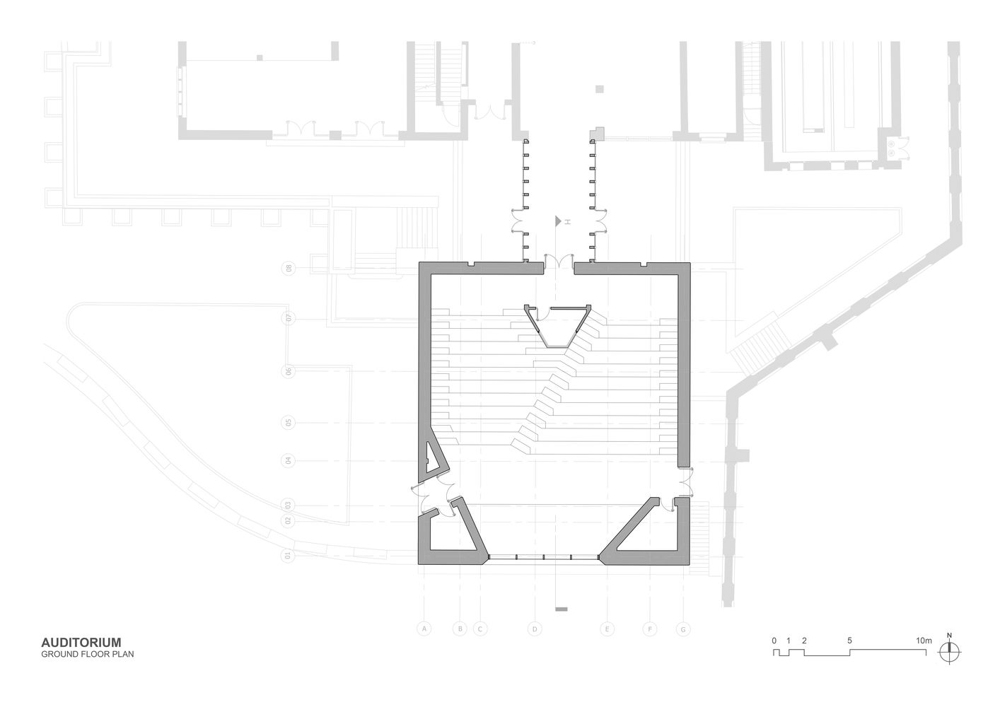
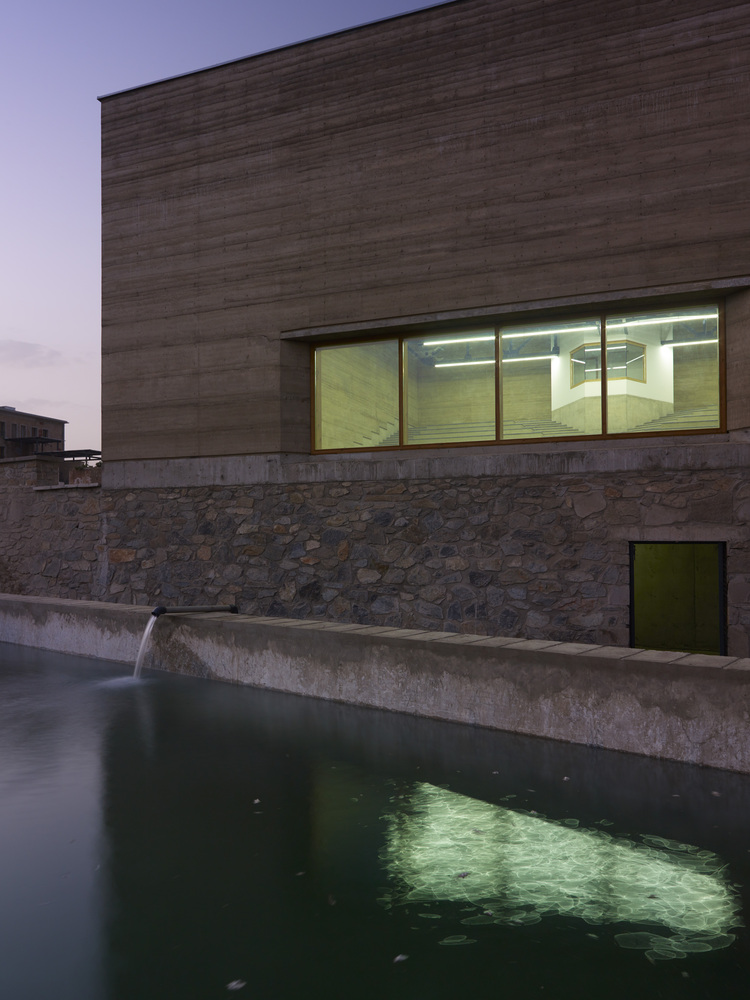
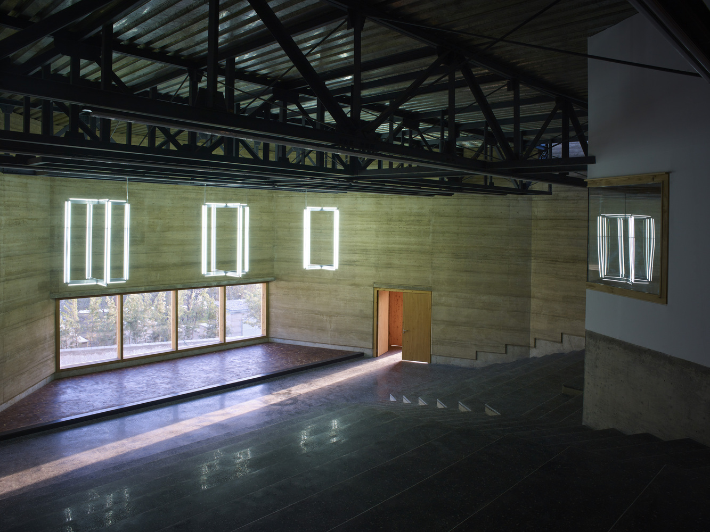

*Photograph of Chihilsitoon Garden in Kabul.*

**My role:** I contributed as part of the Aga Khan Trust for Culture design team.

## Project Overview

The **Chihilsitoon Garden Project** in Kabul restored and updated a historic garden while adding new rammed-earth buildings, sports areas, and commercial spaces. The project was careful not to treat heritage as a museum object. It preserved the site’s historical character while making it useful to contemporary public life.

The architecture draws on materials suited to the local climate and folds modern facilities into the garden’s traditional structure. Water management, public programming, and revenue-generating components were all part of the long-term maintenance strategy.

## Visual Documentation

*Elevation study of the restored palace.*

*The site plan showing the larger public landscape strategy.*

*A view of the garden as lived public space rather than isolated monument.*

*The auditorium plan inserted into the larger garden complex.*

*The auditorium facing water and landscape.*

*Interior atmosphere of the new public building.*

## Why I Value This Project

I value this project because it shows how restoration can remain public-facing. Chihilsitoon protects a historic site, but it also makes room for recreation, gathering, and long-term stewardship. That balance is difficult to achieve, and rare.

## Related Links

- [Full Project on ArchDaily](https://www.archdaily.com/911456/chihilsitoon-garden-project-aga-khan-trust-for-culture)
- [Aga Khan Trust for Culture](https://www.akdn.org/our-agencies/aga-khan-trust-culture)

*Tags: Urban Design · Public Space · Sustainability · Restoration · Architecture · Urban Regeneration · Historic Preservation*
