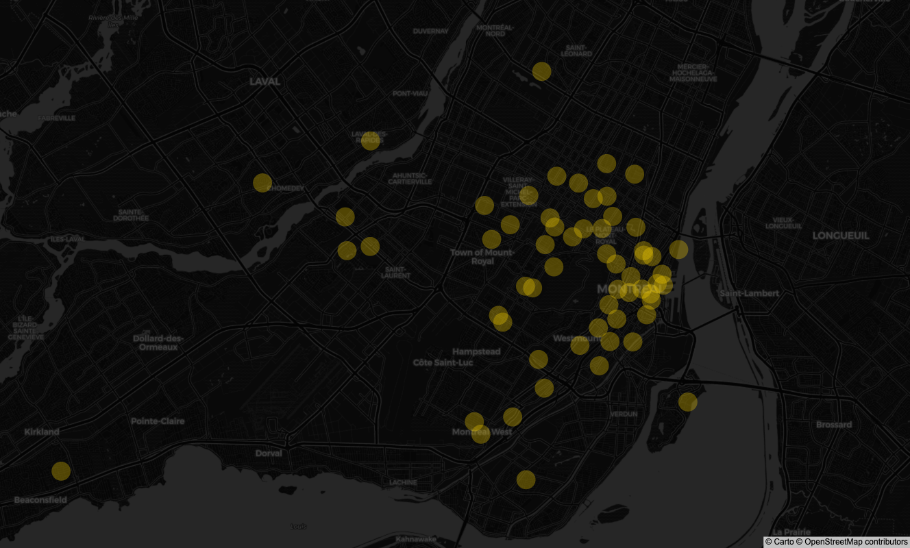

*A pilot project that asked whether AI could help a city see exclusion before residents are forced to live it.*

[Explore the Montréal heatmap](https://mid-spaces.github.io/landing-page/montreal_folium_heatmap_group_inclusivity.html)

## Why I Started This

Public spaces in Canadian cities are rarely evaluated with tools that can compare how exclusion is experienced across gender, age, disability, religiosity, or migration history. As cities grow more diverse, the usual design language often fails to describe who is being left out.

I started this project to build a more grounded way of reading those differences. The aim was not to let AI replace public judgment. It was to let public judgment shape the model from the start.

## What I Built

I combined several layers of evidence.

First, I conducted semi-structured interviews with representatives of diverse communities in Montréal to understand how different groups use and read street space.

Second, I ran focus-group exercises with 20 participants from varied backgrounds, asking them to evaluate safety, accessibility, and inclusion through curated Mapillary images.

Third, I used those criteria to guide pairwise comparisons and labeling across roughly 15,000 street images.

Finally, I fine-tuned a Multi-Layer Perceptron pretrained on ImageNet so it could relate visible street attributes to the inclusivity scores participants had helped define.

## What the Model Showed

The resulting heatmap highlights where Montréal streets appear more or less inclusive according to the model and, by extension, to the criteria that emerged from participatory work.

The system reached roughly **90% predictive accuracy** on the available data, with spatial cues such as sidewalk construction, surrounding buildings, and overall maintenance carrying substantial weight. Just as important, the project showed that the model improved when the criteria came from community engagement rather than from abstract design assumptions.

*The sampled street locations that anchored the project’s first round of analysis.*

## Why This Matters

For planners, the project offers a practical way to identify where attention is needed without pretending that inclusion can be captured through geometry alone.

For participatory AI, it shows that models become more useful when communities help define what the model is actually trying to see.

For public-space design, it offers a way to move from anecdote to evidence without losing the values that make the issue worth studying in the first place.

## What Comes Next

I want to turn the heatmap into a more public-facing platform so residents can explore, question, and contribute to the analysis themselves. I also want to expand the dataset, reduce bias, and test the approach at a larger scale.

## Related Links

- [University of Montreal](https://www.umontreal.ca/)
- [Mila - Quebec AI Institute](https://mila.quebec/en)
- [UNESCO Chair in Urban Landscape](https://unesco-studio.umontreal.ca/)

*Tags: Artificial Intelligence · Urban Planning · Inclusivity · Community Engagement · Public Spaces*
