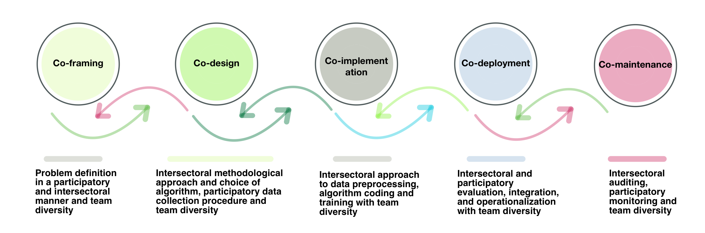
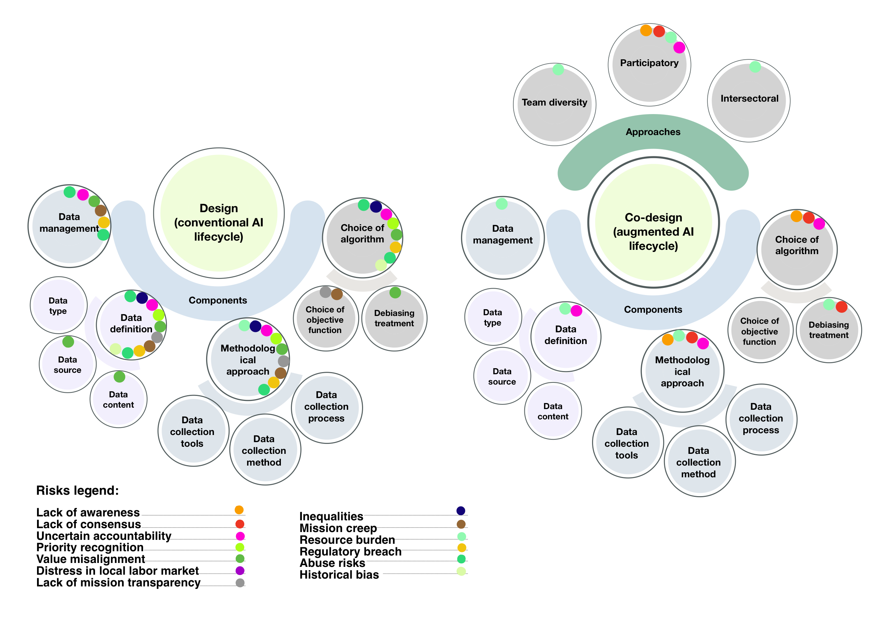

*Five phases for building AI that communities trust, because they helped shape it from the start.*

[Read the Paper on arXiv](https://arxiv.org/abs/2508.00138)

## Why This Matters

Too much AI is still built *about* people, not *with* them.  
**Co-Producing AI** changes that dynamic by treating communities as equal partners at every stage, from defining the problem to deciding when to retire a system.

This isn’t about token feedback sessions or vague promises to “circle back.” It’s about shared power, open choices, and long-term accountability.

## The People-First Lifecycle

The playbook unfolds in five connected phases.

**Co-Framing** is where it starts. Communities and developers work together to define the problem, understand who is most affected, and decide who has a voice—and even veto power—before any model is trained.

In **Co-Design**, decisions about data, models, and interfaces happen in the open. Participatory prototyping weighs trade-offs between accuracy, privacy, explainability, and cost in real time, with all stakeholders at the table.

**Co-Implementation** brings full transparency to training and fine-tuning. Model cards, dataset summaries, and error logs are published for public review.

During **Co-Deployment**, systems go live with clear rules: how to raise issues, how to prevent scope creep, and when to roll things back.

Finally, **Co-Maintenance** ensures the process doesn’t end at launch. Systems are regularly audited—not just for technical drift, but for ethical health and participatory strength. When features change, communities are re-consented.

## What We Learned Along the Way

Shifting real decision-making power to those most affected builds deeper trust.  
Feedback must be continuous, not a one-off formality.  
Privacy needs to be tailored to each context, rather than forced into a single mold.  
And meaningful participation takes resources, funding for travel, childcare, and accessibility so everyone can actually take part.

## What You Leave With

By the end of this process, teams walk away with a governance charter that includes real appeal rights; a public model card and dataset description shaped by community input; a recourse and transparency portal with release notes and audit logs; and an audit schedule that addresses both technology and ethics.

## How This Came Together

The playbook grew out of four multidisciplinary workshops in Montréal (2024), involving 20 experts from research, industry, and civil society. It was informed by a scoping review of 76 key works across computer science, social science, humanities, and policy, spanning 2013 to 2024.

## Why This Approach Stands Apart

Global AI guidelines, from the Montréal Declaration to IEEE EAD, NIST AI RMF, and EU Trustworthy AI, give us principles. This framework adds the missing *“how”*: practical checkpoints, governance routines, and a commitment to ongoing co-maintenance.

## Visuals

  
*Five phases connected by continuous feedback and shared accountability.*

  
*Design vs. Co-design.*

## Where It Works Best

This approach is especially powerful in AI governance, where big ideas need to translate into everyday practice. It’s vital for high-stakes systems in health, finance, and public services, places where trust is not optional. And it can help shift organizational culture away from “participation-washing” toward genuine, resourced involvement.

**Tags:**  
AI Governance · Participatory AI · Co-design · Design Justice · Expansive Learning · DEI
