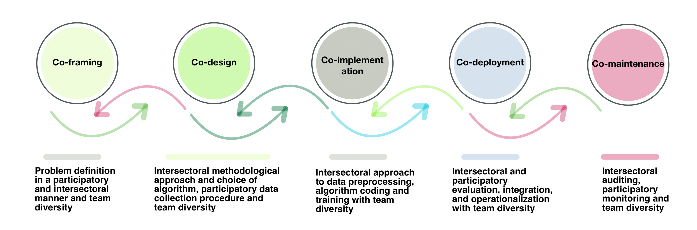
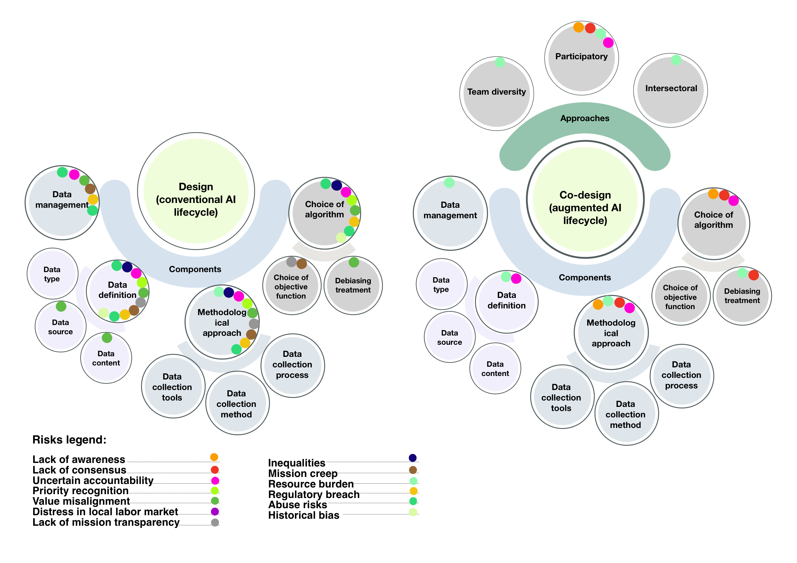

*This work is my argument that participation cannot be bolted onto AI at the end; it has to shape the system from the first problem definition to long after deployment (Mushkani et al., 2025).*

[Read the Paper on arXiv](https://arxiv.org/abs/2508.00138)

## Why The Lifecycle Matters

Too much AI is still built *about* people rather than *with* them. The result is familiar: communities appear in the workflow as data sources, testers, or affected populations, but not as co-authors of the decisions that govern the system's purpose, risks, and limits (Mushkani et al., 2025). The paper responds to that gap by proposing an augmented lifecycle that treats co-production, design justice, and multidisciplinary collaboration as part of the architecture of AI work rather than as optional ethics language layered on top (Mushkani et al., 2025).

What matters to me here is the refusal to confuse consultation with shared authority. The argument is not that communities should be heard more politely. It is that they should be structurally present wherever the system is framed, built, deployed, and revised (Mushkani et al., 2025).

## The Five Phases, In Plain Language

The framework is organized into five connected phases: **co-framing**, **co-design**, **co-implementation**, **co-deployment**, and **co-maintenance** (Mushkani et al., 2025). In plain terms, that means people affected by a system should help define the problem before a model is chosen, weigh design trade-offs while the system is being built, inspect what is documented during implementation, shape how the system enters the world, and retain a role after launch when harms, drift, and scope creep become visible (Mushkani et al., 2025).

That last phase matters. A system can be launched with generous promises and still become brittle, extractive, or misaligned once budgets tighten or product priorities change. The paper treats maintenance as a governance responsibility, not merely a technical aftercare task (Mushkani et al., 2025).

## What The Framework Produces

The practical output is a working package: a governance charter, public documentation, recourse pathways, release and audit routines, and a process for revisiting consent and participation when the system changes (Mushkani et al., 2025). In other words, the framework tries to turn ethics into operating procedure.

The framework also fits the wider line of work on participatory AI in cities. It treats public knowledge as part of the system design process rather than as feedback collected after the main decisions have already been made (Mushkani et al., 2025).

## Why I Think It Is Useful

What distinguishes this framework is not that it offers new principles. It is that it offers a sequence of checkpoints where power, evidence, and accountability can be negotiated in concrete terms. That makes it useful for public-sector, health, civic, and urban AI systems, where communities do not merely experience the consequences of design decisions but live inside them (Mushkani et al., 2025).

## Visuals

  
*Five phases connected by continuous feedback and shared accountability.*

  
*Design and co-design compared.*

## References

Mushkani, R., Berard, H., Ammar, T., Chatonnier, C., & Koseki, S. (2025). *Co-producing AI: Toward an augmented, participatory lifecycle*. arXiv. https://arxiv.org/abs/2508.00138
