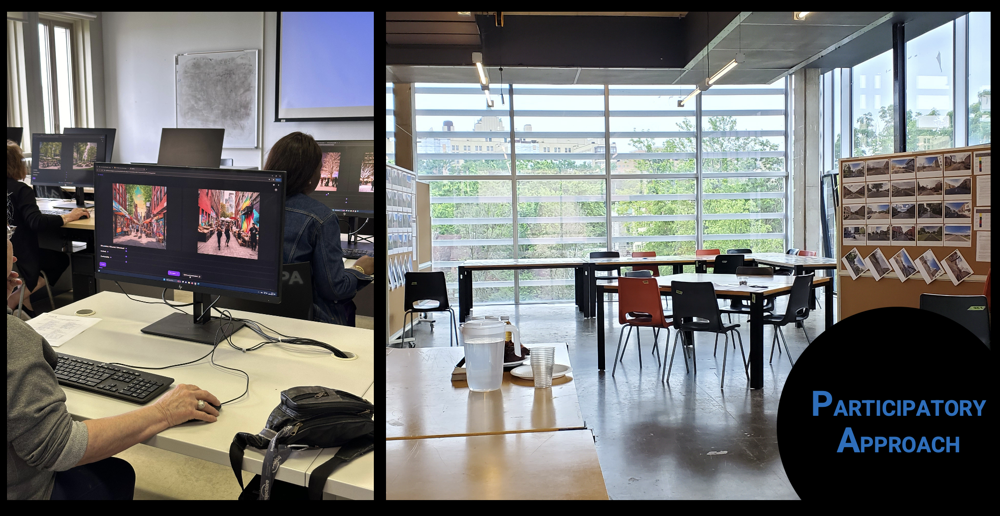
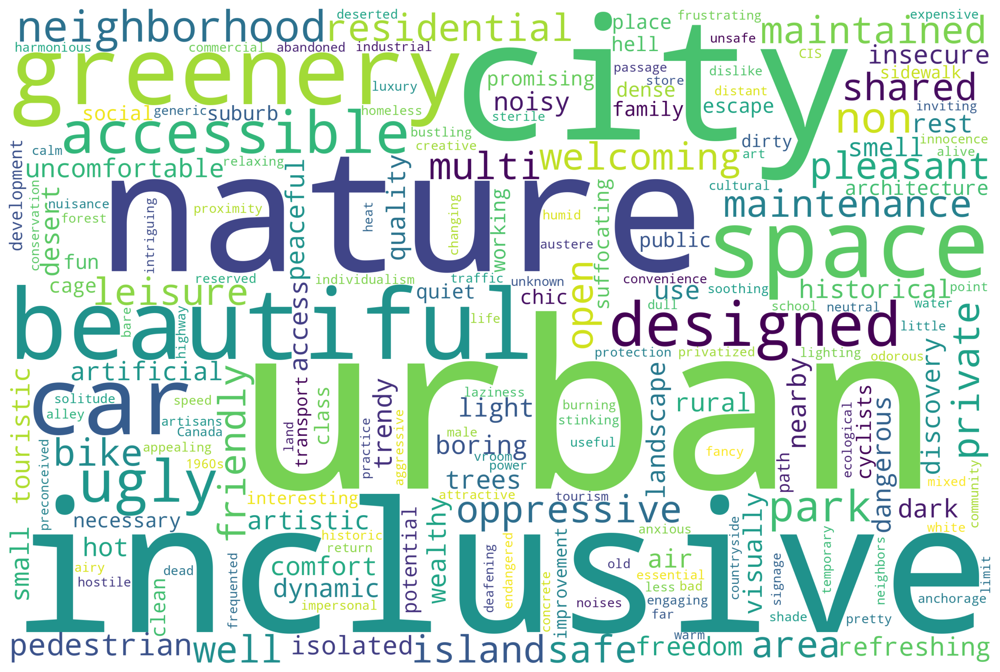

*Pluralistic alignment for cities: six criteria, many voices, no one-size-fits-all.*

[Read on arXiv](https://arxiv.org/abs/2503.01894) · [OpenReview (ICML 2025)](https://openreview.net/forum?id=Spoe53kbj9) · [Project & Dataset](https://mid-space.one)

## The Big Idea

**LIVS (Local Intersectional Visual Spaces)** is a people-in-the-loop benchmark for multi-criteria alignment of text-to-image models in urban planning. It asks:  
> How do different communities *actually* want public spaces to look and feel—and can models reflect that?

Across a two-year partnership with 30 community organizations in Montréal, we gathered local concepts of inclusive design, then turned them into structured preferences that can steer generative models toward context-aware outputs.

## Why This Matters

Global, single-objective alignment often flattens local norms. **Pluralistic alignment** keeps multiple, sometimes conflicting, values in play—like **Accessibility, Safety, Comfort, Invitingness, Inclusivity,** and **Diversity**—so visualizations can reflect *who a place is for* as much as *what it contains*. That’s crucial when designs affect marginalized users differently.

## How We Did It

**Participants & Process:** Two years with **30 orgs**; workshops, interviews, and participatory prompt design.  
**From concepts to criteria:** **634** community-defined ideas distilled into **six** criteria.  
**Images & Annotations:** **13,462** images, **37,710** pairwise comparisons (multi-criteria sliders).  
**Modeling:** Fine-tuned **Stable Diffusion XL** with **Direct Preference Optimization (DPO)** using multi-criteria signals.  
**Evaluation:** In 2,200 new comparisons, annotators preferred the DPO-aligned model more often where annotation volume was higher; about half of judgments were neutral—evidence that values are heterogeneous and sometimes visually subtle.

## What We Found

- **No single “best” image:** Improvements varied by criterion; **Comfort/Invitingness** benefited most from data volume; **Inclusivity/Diversity** remained harder to judge and to render consistently.  
- **Identity matters:** Preference patterns differed across participant identities—supporting intersectional data over an “average user.”  
- **Prompts matter, too:** Human-authored prompts produced more distinctive outputs—and more decisive annotations—than LLM-generated ones.  
- **Neutral is a signal:** High neutrality often meant subtle trade-offs or ambiguous visuals, not noise—pointing to richer objective formulations beyond single binary labels.

## Where This Can Be Used

- **Public engagement:** Generate options that mirror local priorities and surface trade-offs in workshops.  
- **Design iteration:** Rapidly visualize accessibility, comfort, or safety tweaks grounded in multi-criteria feedback.  
- **Policy & research:** Compare criteria across groups; explore steerable or personalized alignment strategies for different communities.

## Visuals

  

  
*A two-year co-creation process: outreach → criteria → prompts → images → multi-criteria comparisons → model tuning.*

---

  

  
*Distillation pipeline: Accessibility · Safety · Comfort · Invitingness · Inclusivity · Diversity.*

---

  

  
*Persistent gaps: intersectional identities consistently differ in their evaluations compared to majority groups.*

---

**More:** [arXiv](https://arxiv.org/abs/2503.01894) · [OpenReview / ICML 2025](https://openreview.net/forum?id=Spoe53kbj9) · [Project & Dataset (mid-space.one)](https://mid-space.one)

*Tags: Pluralistic Alignment · Text-to-Image · Inclusive Urbanism · Multi-Criteria Preferences · Accessibility · Montréal*
