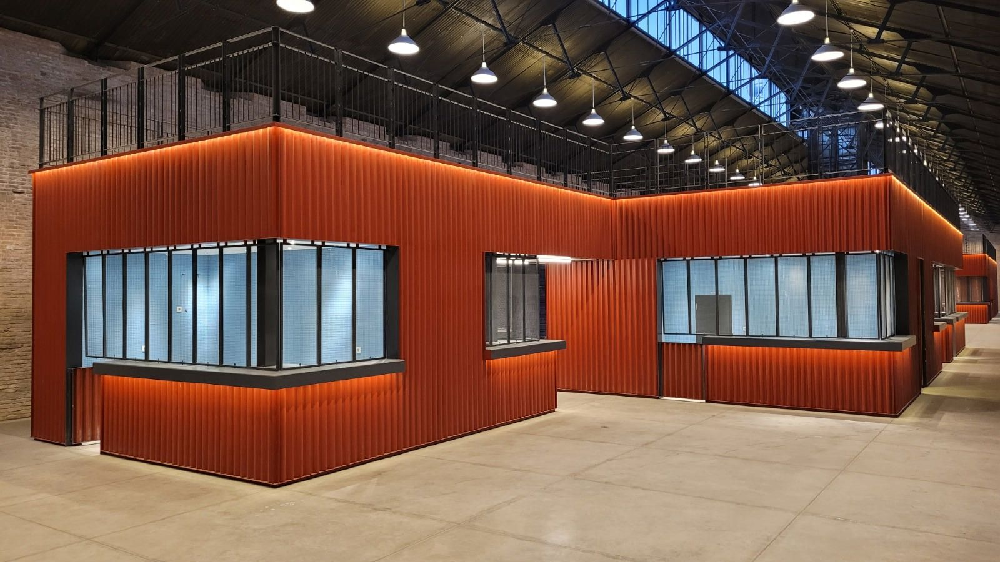
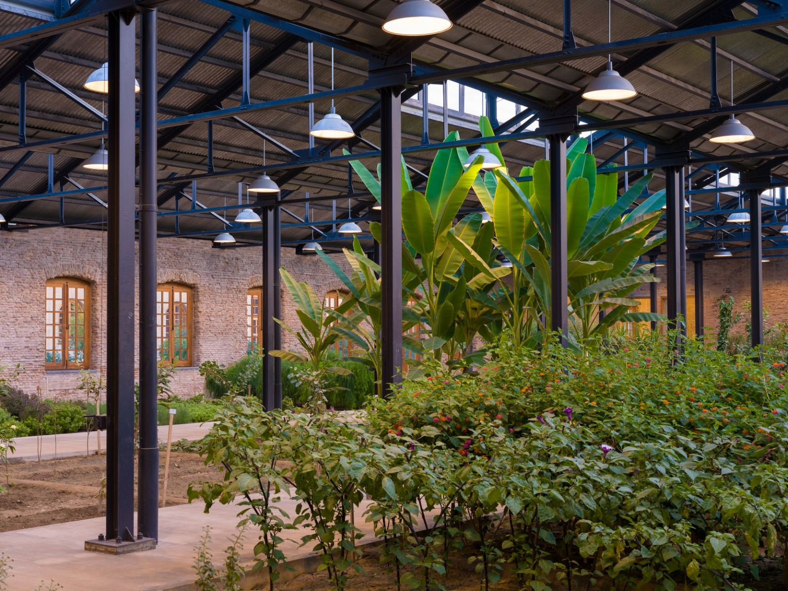
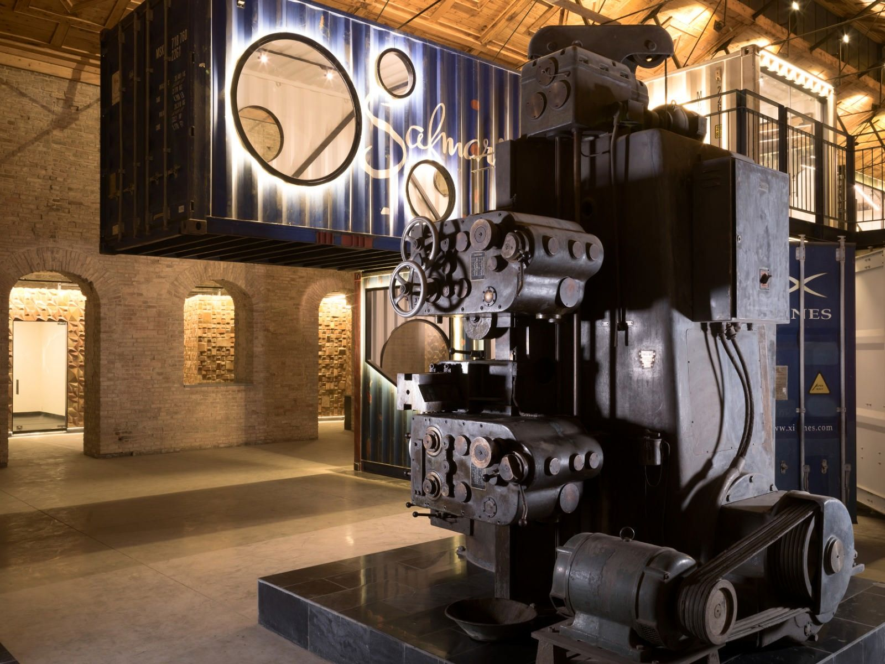

*Machine Khana shows how conservation can serve daily urban life instead of separating heritage from it (Aga Khan Cultural Services-Afghanistan, 2024; Aga Khan Trust for Culture, 2024).*

## Project Overview

Machine Khana sits within the Kabul Riverfront Transformation project, an effort to create a heritage zone along the Kabul River and improve living, working, and environmental conditions in central Kabul (Aga Khan Cultural Services-Afghanistan, 2024; Aga Khan Trust for Culture, 2024). A central part of that effort was the rehabilitation and adaptive reuse of the late nineteenth-century Machine Khana industrial complex into a site for commercial, cultural, educational, and civic use (Aga Khan Cultural Services-Afghanistan, 2024; Aga Khan Trust for Culture, 2024).

According to the project brief and site documentation, the rehabilitation modernized existing warehouses and administrative blocks, added service buildings and infrastructure, and paired restoration with landscaping, drainage, lighting, and public amenities intended to reactivate the riverfront for daily use (Aga Khan Cultural Services-Afghanistan, 2024; Aga Khan Trust for Culture, 2024). The goal was economic as well as civic: to turn underused industrial heritage into a working urban asset (Aga Khan Cultural Services-Afghanistan, 2024; Aga Khan Trust for Culture, 2024).

## Why It Matters

Machine Khana does not treat preservation and present-day need as opposites. The project reuses historic industrial buildings while opening space for commerce, public services, exhibition, and cultural activity, tying architectural repair to urban livelihood and public life in central Kabul (Aga Khan Cultural Services-Afghanistan, 2024; Aga Khan Trust for Culture, 2024).

## Visual Documentation

*Retail spaces inserted into the rehabilitated warehouse complex.*

*A restored industrial interior adapted for contemporary use.*

*Adaptive reuse inside the Machine Khana complex.*

## References

Aga Khan Cultural Services-Afghanistan. (2024). *Project brief: Machine Khana*. Archnet. https://www.archnet.org/publications/15256

Aga Khan Trust for Culture. (2024). *Machine Khana Rehabilitation*. Archnet. https://www.archnet.org/sites/21839
