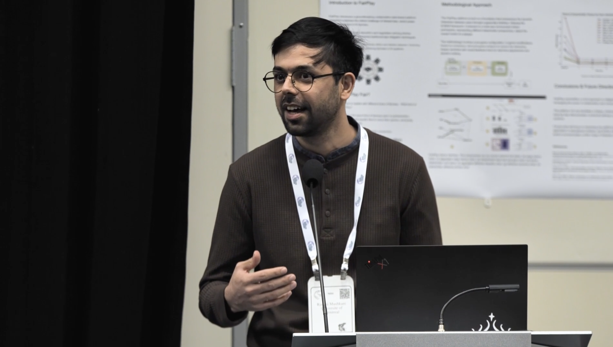
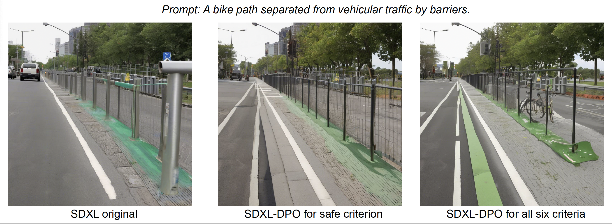

*Example visualizations generated using Stable Diffusion XL, fine-tuned with the MID-Space dataset.*

**Project Team:** Shravan Nayak, Rashid Mushkani, Hugo Berard, Allison Cohen, Shin Koseki, Hadrien Bertrand, Emmanuel Beaudry Marchand, Toumadher Ammar, Jerome Solis.

[Watch the Lecture on NeurIPS](https://neurips.cc/virtual/2024/109216)

## Project Overview

The **MID-Space** dataset bridges the gap between AI-generated visualizations and diverse community preferences in public space design. Created through participatory workshops and fine-tuned using Stable Diffusion XL, the dataset aligns AI outputs with six key criteria:

- **Accessibility**
- **Safety**
- **Diversity**
- **Inclusivity**
- **Invitingness**
- **Comfort**

This initiative empowers marginalized communities to actively shape urban design, promoting inclusive, equitable, and user-centered public spaces.

## Dataset Features

- **Textual Prompts:** 3,350 prompts representing diverse public space typologies.
- **AI-Generated Images:** 13,465 visualizations created with Stable Diffusion XL.
- **Annotations:** Over 42,000 (in raw) and 35,000 distinct annotations evaluating preferences on a -1 to +1 scale for up to three criteria per image pair.

## Data Collection Process

1. **Community Workshops:**
   - Conducted three workshops with diverse Montreal communities to identify six alignment criteria.
   - Generated 440 textual prompts, expanded to 2,910 synthetic prompts using GPT-4.

2. **Image Generation:**
   - Stable Diffusion XL created 20 images per prompt, refined using CLIP similarity scoring.

3. **Human Annotation:**
   - Sixteen annotators evaluated image pairs through an accessible web interface.

---
## Visual Documentation

*Fine-tuned visualization emphasizing safety.*

*Visualization promoting inclusivity versus all criteria.*

## Applications

The MID-Space dataset is a valuable resource for:

- **AI Alignment Research:** Developing models that better reflect pluralistic human values.
- **Urban Design:** Crowd-sourcing input for inclusive public space design.
- **Generative AI Tools:** Enhancing text-to-image models for equity-focused visualization tasks.

## Further explore by clicking here: [MID-Space Viewer](https://cupum-mid-space-viewer.hf.space)

## Related Links

- [View Dataset on Hugging Face](https://huggingface.co/datasets/CUPUM/mid-space)
- [UNESCO Chair in Urban Landscape](https://unesco-studio.umontreal.ca/)
- [Mila – Quebec AI Institute](https://mila.quebec/)

## Tags

  Generative AI
  Urban Planning
  Inclusivity
  Community Engagement
  Public Spaces

