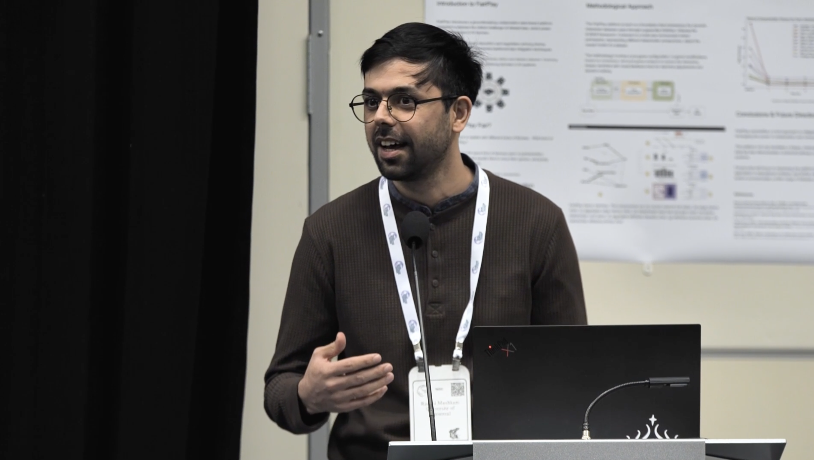
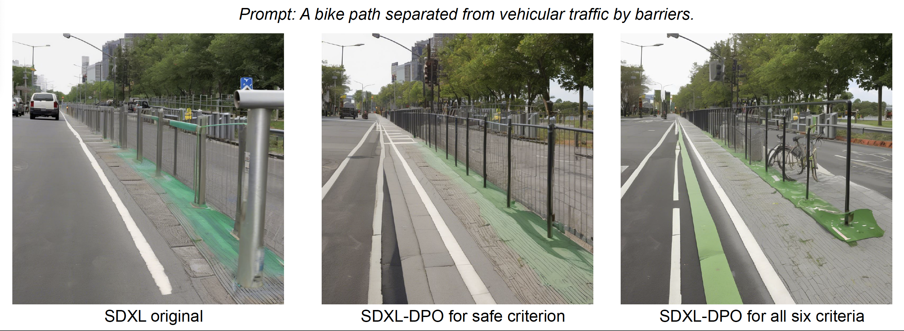

*MID-Space began from a gap: image-generation systems can produce urban scenes, but they do not naturally reflect what different communities want from public space (Nayak et al., 2024).*

[Watch the Lecture on NeurIPS](https://neurips.cc/virtual/2024/109216) · [View the Dataset on Hugging Face](https://huggingface.co/datasets/CUPUM/mid-space)

## Why MID-Space Exists

The dataset was built to align AI-generated visualizations of urban public spaces with the preferences of diverse and marginalized communities in Montréal, using six criteria that emerged from participatory work: accessibility, safety, diversity, inclusivity, invitingness, and comfort (Nayak et al., 2024). The point was not to produce one ideal image of the city. It was to make room for the fact that different people want different things from public space, and that those differences should shape the model rather than be erased by it (Mushkani et al., 2025; Nayak et al., 2024).

## What The Dataset Contains

The dataset combines prompts, generated images, and pairwise preference annotations collected through workshops, image generation, and community-based evaluation tasks (Nayak et al., 2024). It was built to support public discussion about place, not just model benchmarking (Nayak et al., 2024; Mushkani et al., 2025).

## How I Built It

The process moved in stages: participants first identified the criteria that mattered, prompts were then expanded and turned into image sets with Stable Diffusion XL, and annotators compared those image pairs through an accessible interface using a scale from -1 to +1 (Nayak et al., 2024). The dataset was designed to expose trade-offs rather than collapse them into one default aesthetic (Nayak et al., 2024).

## What It Makes Possible

MID-Space matters because it shifts generative AI away from abstract visual preference and toward public reasoning about place. That makes it useful for participatory urban visualization, for community-informed design discussion, and for later pluralistic alignment work that asks how models can remain answerable to multiple publics at once (Mushkani et al., 2025; Nayak et al., 2024).

*A generated public-space image emphasizing safety and legibility.*

*A comparison in which inclusivity shifts alongside other criteria.*

## References

Mushkani, R., Nayak, S., Berard, H., Cohen, A., Koseki, S., & Bertrand, H. (2025). *LIVS: A pluralistic alignment dataset for inclusive public spaces*. Proceedings of the 42nd International Conference on Machine Learning. https://arxiv.org/abs/2503.01894

Nayak, S., Mushkani, R., Berard, H., Cohen, A., Koseki, S., & Bertrand, H. (2024). *MID-Space: Aligning diverse communities' needs to inclusive public spaces*. OpenReview. https://openreview.net/forum?id=kyfkMRT4Ao
