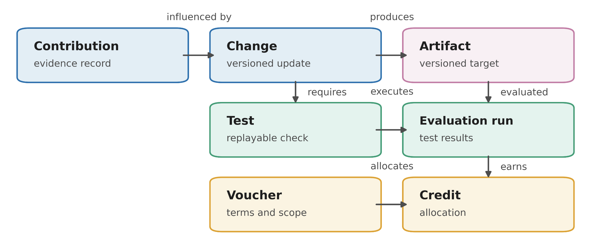

*The Participation Ledger asks a direct question: if public participation matters, why is it so rarely recorded in a way that can be traced, enforced, or fairly compensated later (Mushkani, 2026; Mushkani et al., 2025)?*

[Read on arXiv](https://arxiv.org/abs/2602.10916) · [View the PAIRS presentation page](https://www.pairs.site/Rights-and-incentives-A-participation-ledger-for-people-centered-AI-2fd260e24e1a81c3be45fa84ae19ebd2?pvs=21)

## Why The Ledger Was Built

Participatory AI is now widely discussed, but participation too often ends where the workshop ends. People annotate, deliberate, file harms, or help define criteria; then the model changes, the interface changes, the institution changes, and the original contribution becomes difficult to recover in any durable way. When that happens, participation becomes easy to praise and easy to ignore.

That problem follows directly from the concerns raised in my earlier work on the **Right to AI**. If communities are meant to shape AI systems in meaningful ways, their influence cannot remain informal, buried in slide decks, or reduced to institutional memory. It needs a record, a mechanism, and a set of rights that survive version changes and organizational turnover (Mushkani et al., 2025).

## The Core Idea

The **Participation Ledger** is a machine-readable framework for recording how participation affects AI systems over time (Mushkani, 2026). In practice, it links contributions such as annotations, prompts, tests, deliberations, incident reports, and policy requests to concrete system changes in datasets, prompts, adapters, rules, guardrails, and evaluation suites. The goal is to make participation inspectable rather than ceremonial.

The framework has three main parts. First, a **Participation Evidence Standard** records the terms of participation itself: who took part, in what role, under what consent, privacy, compensation, and reuse conditions. Second, an **influence-tracing layer** connects those contributions to replayable tests, so later versions can be checked against earlier commitments. Third, a set of governance instruments, including **Capability Vouchers** and **Participation Credits**, is meant to give communities durable standing rather than symbolic presence.

## Why That Matters

What I care about here is not record-keeping for its own sake. It is the shift in power that record-keeping can make possible. If a community-raised concern can be tied to a concrete system change and retested later, the system has a memory of its social commitments. If participation can trigger rights or ongoing recognition, it starts to look less like unpaid civic labor and more like governance infrastructure.

This is especially relevant for public-sector and civic AI, where systems move across institutional boundaries and where legitimacy depends on more than technical performance. Urban planning tools, consultation platforms, participatory datasets, procurement systems, and public-service models all need a way to show not just that participation happened, but what it changed and whether those changes endured.

## Visual

*Conceptual overview of the Participation Ledger.*

## Why It Matters Beyond One Project

For me, the ledger is ultimately about power. It asks what would need to change for communities to move from being consulted at the edges of AI systems to being recognized as participants in governance across versions, vendors, and time. That is a technical question, but it is also a constitutional one.

**More:** [arXiv](https://arxiv.org/abs/2602.10916) · [PAIRS presentation page](https://www.pairs.site/Rights-and-incentives-A-participation-ledger-for-people-centered-AI-2fd260e24e1a81c3be45fa84ae19ebd2?pvs=21)

## References

Mushkani, R. (2026). *Traceable, enforceable, and compensable participation: A participation ledger for people-centered AI governance*. arXiv. https://arxiv.org/abs/2602.10916

Mushkani, R., Berard, H., Cohen, A., & Koseki, S. (2025). *Position: The Right to AI*. arXiv. https://arxiv.org/abs/2501.17899
