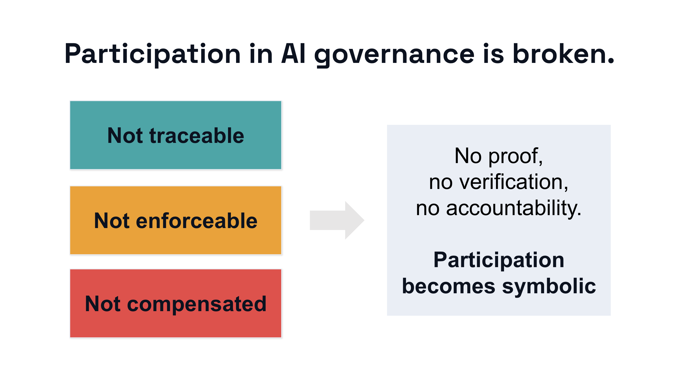

*A framework for turning community input into something durable, auditable, and actionable across the AI lifecycle.*

[Read on arXiv](https://arxiv.org/abs/2602.10916) · [View the PAIRS presentation page](https://www.pairs.site/Rights-and-incentives-A-participation-ledger-for-people-centered-AI-2fd260e24e1a81c3be45fa84ae19ebd2?pvs=21)

## Why This Matters

Participatory AI is now widely discussed, but too often participation ends where the workshop ends.

People are invited to comment, annotate, deliberate, or report harms. Then the system changes, the model is updated, the vendor shifts direction, and the original contribution becomes hard to trace. In many cases, participation leaves almost no durable record of what changed, who decided, or whether commitments were kept.

If participation cannot be traced, it is easy to ignore. If it cannot be enforced, it remains advisory. If it is never compensated, it becomes difficult to sustain fairly.

## The Problem

Public-sector and civic AI systems often rely on community knowledge, yet that knowledge is usually documented informally and kept separate from the technical systems it is supposed to shape.

Prompts, annotations, meeting notes, incident reports, and evaluative feedback can all influence a system. But these artifacts rarely travel forward in a structured way. They are not reliably tied to model updates, deployment rules, or future evaluation. As a result, participation is often symbolic rather than accountable.

## The Core Idea

I developed the **Participation Ledger** as a machine-readable, auditable framework for recording how participation affects AI systems over time.

It treats participation as traceable influence. Contributions are linked to concrete changes in datasets, prompts, adapters, policies, guardrails, or evaluation suites. Those changes are then tied to replayable tests, so commitments can be checked again in future releases.

Instead of asking people to trust that input mattered, the ledger creates a record that can be inspected.

## Three Building Blocks

### 1) A Participation Evidence Standard

The first layer records the conditions of participation itself: who took part, in what role, under which consent and privacy terms, with what compensation, and under what reuse boundaries.

This matters because participation is never neutral. Recruitment pathways, intermediaries, honoraria, consent scope, and retention rules all shape what participation means in practice.

### 2) Influence Tracing and Tests of Change

The second layer links contributions to system changes and to replayable tests.

A community-raised concern should not stay trapped in a workshop summary. It should become something that can be tested again later. If a later version of the model fails the same test, the regression becomes visible.

This turns participation into part of the system's memory, not just part of its origin story.

### 3) Rights and Incentives

The third layer introduces governance primitives that make participation more durable.

**Capability Vouchers** allow authorized community stewards to request, constrain, or pause specific system capabilities within a defined adoption boundary.

**Participation Credits** create auditable recognition for contributions that continue to generate value over time, such as tests that catch regressions or artifacts that remain in active evaluation use.

Together, these mechanisms push participation closer to infrastructure: something that can be traced, activated, and maintained.

## Where This Can Be Used

The ledger is especially relevant for public-sector and civic AI, where systems often cross institutional boundaries and where community input is central to legitimacy.

It is useful for urban planning tools, consultation platforms, participatory datasets, model evaluation pipelines, and procurement settings where organizations need evidence that commitments are being maintained after deployment, not merely promised before it.

## Visual

*Conceptual overview of the Participation Ledger and its role in making AI participation traceable, enforceable, and durable.*

## Why This Matters Beyond One Project

The Participation Ledger is ultimately about power.

I see it as a way of asking what it would take for participation to endure across versions, across organizations, and across time. It asks how communities can move from being sources of feedback to recognized participants in governance. It also asks how technical systems can remember the social commitments they are built on.

**More:** [arXiv](https://arxiv.org/abs/2602.10916) · [PAIRS presentation page](https://www.pairs.site/Rights-and-incentives-A-participation-ledger-for-people-centered-AI-2fd260e24e1a81c3be45fa84ae19ebd2?pvs=21)

*Tags: Participatory AI · AI Governance · Auditability · Public Sector AI · Urban AI · Accountability*
