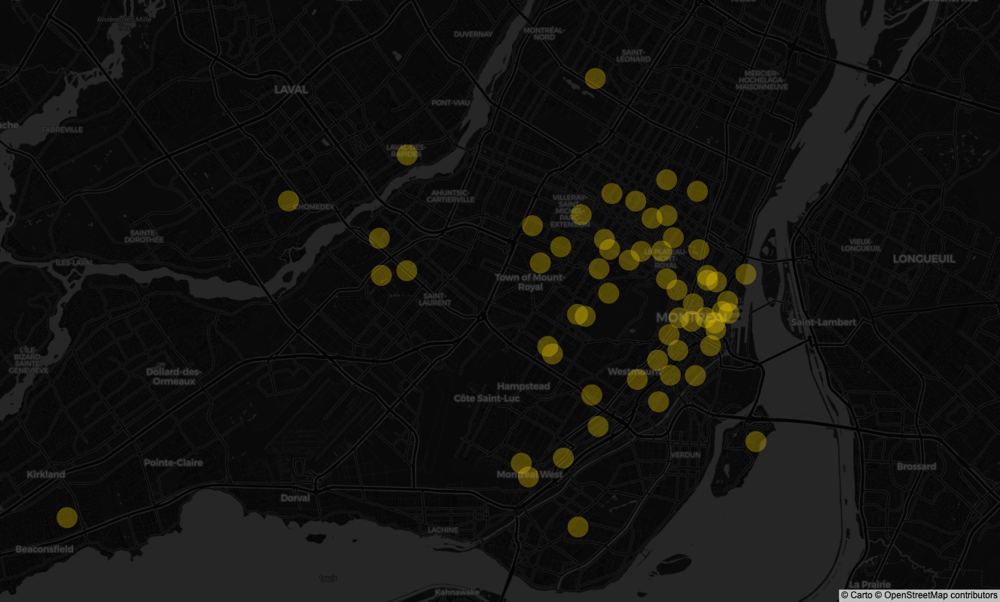
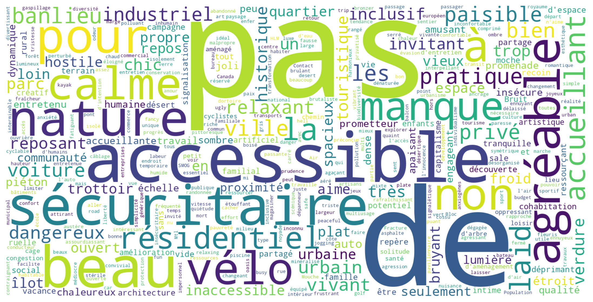

*No single street met all needs—what we learned from talking, walking, and rating.*

[Read on ScienceDirect](https://doi.org/10.1016/j.habitatint.2025.103536)  
[View Dataset on Hugging Face](https://huggingface.co/datasets/rsdmu/streetreview)

## 🚶 The Big Idea

**Street Review** is a people-powered audit that asks:  
> “Who actually feels welcome here—and who doesn’t?”

We blend **interviews**, **focus groups**, and **structured ratings** to see how different communities experience city streets.  
Our Montréal study found something striking: **not a single street met all intersectional user needs**.  
But—when groups sat down to talk—they could start negotiating what “inclusive” really means.

## Why This Matters

- Inclusive streets aren’t just about ramps and benches—they must **signal belonging** to people of different cultures, ages, and mobilities.  
- Group conversations can shift how people see *accessibility*, but *inclusivity* is still a tough nut to crack.  
- Comparing pre- and post-visit ratings shows how **familiarity changes perception**.  
- Results point toward **context-specific, diversity-sensitive design**—not one-size-fits-all fixes.

## How We Did It

- **Participants:** 28 in interviews/focus groups; 12 gave structured ratings.  
- **Sampling:** 20 streets × 3 vantage points × 2 images → **60 locations / 120 images**.  
- **Criteria:** Diversity in land use, history, density, greenery, and amenities.  
- **Data:** 600+ descriptors distilled into **4 core dimensions**: Inclusivity, Accessibility, Aesthetics, Practicality.  
- **Analysis:** Thematic coding, LDA topic modeling, and correlation checks across intersectional groups.

## What We Found

- Most streets scored **okay**, but rarely excelled across all dimensions.  
- **No street** worked for everyone—barriers differed by identity (e.g., LGBTQIA2+, mobility-impaired, elderly, newcomers).  
- **Accessibility** and **Practicality** often went hand-in-hand; **Aesthetics** was a wildcard.  
- Group dialogue boosted awareness of accessibility gaps, but *inclusivity debates* stayed heated.

## Where This Can Be Used

- **Urban Planning:** Combine solo and group feedback to shape street design.  
- **Policy:** Add multilingual signs and cultural cues that say “you belong here.”  
- **Research:** Adapt the Street Review for other cities and contexts.

## Visuals

  
*60 locations representing diverse street contexts.*

  
*Descriptors grouped into four main dimensions.*

**Links:**  
- Journal Article → [Habitat International](https://doi.org/10.1016/j.habitatint.2025.103536)  
- Dataset → [Hugging Face](https://huggingface.co/datasets/rsdmu/streetreview)  
- UNESCO Chair in Urban Landscape → <https://unesco-studio.umontreal.ca/>  

**Tags:**  
Inclusive Urbanism · Street Design · Accessibility · Inclusivity · Participatory Methods · Montréal
