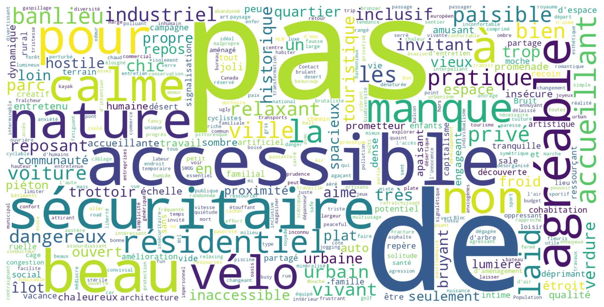

*Street Review began from a clear finding: no single street in the study performed well for everyone, and that was the point of the method (Mushkani & Koseki, 2025).*

[Read on Habitat International I ScienceDirect](https://doi.org/10.1016/j.habitatint.2025.103536) · [View Dataset on Hugging Face](https://huggingface.co/datasets/rsdmu/streetreview)

## Why Street Review Started

Inclusive streets are often discussed as if the problem were mainly technical: add the right furniture, fix the curb, improve the lighting, and the street becomes fairer. My experience in Montréal suggested something else. The same street could feel practical to one person, confusing to another, and exclusionary to a third, depending on mobility, identity, memory, and familiarity with the place.

Street Review was my answer to that problem. I wanted a method that could take disagreement seriously rather than average it away, and that could show planners how different publics read the same street through different lived realities.

## How The Framework Works

The published study combined interviews, focus groups, and structured image-based ratings to examine 20 Montréal streets through 60 vantage points, using 12 participants to rate **inclusivity**, **accessibility**, **aesthetics**, and **practicality** from both newcomer and long-term resident perspectives (Mushkani & Koseki, 2025). The key move was not only to collect ratings, but to compare what changed when people discussed the same images together.

That design matters because it lets the method capture two kinds of knowledge at once: first impressions and negotiated understanding. In practice, the conversation often became as revealing as the scores. People were not just rating streets. They were working through what "inclusive" meant, for whom, and under what conditions.

## What It Showed

The study found that most streets performed moderately and that no single street satisfied all intersectional needs. Group deliberation helped calibrate judgments and surface conflicts rooted in identity, mobility, tourism, and everyday familiarity. That made the method useful not because it produced one final answer, but because it made the fault lines of public judgment visible.

Later work extended the same logic into city-scale image analysis, but the core lesson remained the same: public-space evaluation improves when disagreement is treated as evidence rather than error (Mushkani & Koseki, 2026).

## Why It Matters

For planners, Street Review offers a way to move beyond checklists without abandoning structure. For policy teams, it suggests that multilingual cues, cultural legibility, and the social meaning of design choices matter alongside formal accessibility measures. For me, its value is simpler: it gives cities a method for asking who feels welcome here, and then staying long enough to hear that question answered in more than one voice.

## Visuals

  
*Sixty sampled locations across Montréal.*

  
*Descriptors gathered through the Street Review process.*

**More:** [Habitat International](https://doi.org/10.1016/j.habitatint.2025.103536) · [Dataset](https://huggingface.co/datasets/rsdmu/streetreview)

## References

Mushkani, R., & Koseki, S. (2025). *Intersecting perspectives: A participatory street review framework for urban inclusivity*. Habitat International, 164, 103536. https://doi.org/10.1016/j.habitatint.2025.103536

Mushkani, R., & Koseki, S. (2026). *Street review: A participatory AI-based framework for assessing streetscape inclusivity*. Cities, 170, 106602. https://doi.org/10.1016/j.cities.2025.106602
