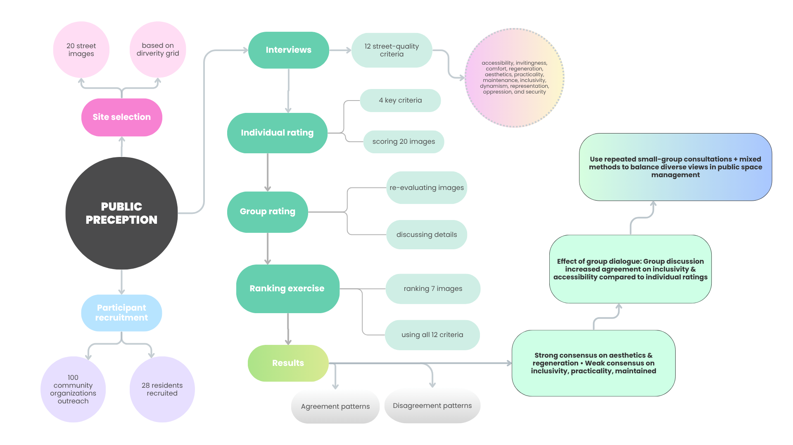

*A street can look straightforward on paper and still divide people in practice, which is why this study focuses on where Montréalers agree, where they split, and what discussion changes (Mushkani et al., 2025).*

[Read the paper on ScienceDirect](https://www.sciencedirect.com/science/article/pii/S2226585625001116)

## What The Study Examined

Cities often evaluate street quality through audits and standardized indicators, yet lived experience is shaped by age, mobility, class, culture, language, and identity in ways that checklists rarely capture. I wanted to know where Montréal residents tend to converge in their judgments, where they diverge, and whether structured small-group discussion could turn contested impressions into guidance for public-space management.

## How The Study Worked

The published research unfolded in stages. Semi-structured interviews with 28 Montréal residents helped surface 12 recurring criteria for describing streets, including **accessibility**, **comfort**, **inclusivity**, **maintenance**, **representation**, and **security**. From there, 12 participants in three mixed-background groups rated 20 curated street images on **practicality**, **aesthetics**, **accessibility**, and **inclusivity**, first individually and then after discussion. A separate ranking exercise with 17 participants ordered seven images across all 12 criteria (Mushkani et al., 2025).

I used that design because I was less interested in a single average score than in the social life of judgment itself: how people explain what they see, where their definitions collide, and when conversation clarifies rather than blurs disagreement.

## What The Findings Showed

Agreement was strongest for qualities tied to visible shared cues, especially **aesthetics** and **regenerative** features such as greenery, coherence, and spaces that feel restorative. Agreement was weakest for **inclusivity**, **practicality**, and sometimes **maintenance**, where interpretation depended more heavily on biography, context, and prior experience.

One finding is that small-group dialogue tightened agreement, particularly around **accessibility** and **inclusivity**. Discussion helped participants say what they meant by "for whom" and "in what situation," producing judgments that were more stable than individual ratings alone. That is a managerial insight as much as a methodological one.

## Why It Matters For Public Space Management

Some street qualities respond well to technical audits: curb ramps, seating, lighting, shade, and other physical benchmarks. But the study suggests that contested qualities, especially inclusivity, cannot be managed well through checklists alone. They require recurring, localized conversations that let residents define what publicness, comfort, and belonging mean in the places they actually use (Mushkani & Koseki, 2025).

For me, that is the takeaway. Inclusive management is not just better measurement. It is better listening, repeated often enough to affect decisions before disagreement hardens into exclusion.

*Summary of methods and findings for the Montréal street perception study.*

## References

Mushkani, R., & Koseki, S. (2025). *Intersecting perspectives: A participatory street review framework for urban inclusivity*. Habitat International, 164, 103536. https://doi.org/10.1016/j.habitatint.2025.103536

Mushkani, R., Berard, H., Ammar, T., & Koseki, S. (2025). *Public perceptions of Montréal's streets: Implications for inclusive public space making and management*. Journal of Urban Management, Advance online publication. https://doi.org/10.1016/j.jum.2025.07.004
