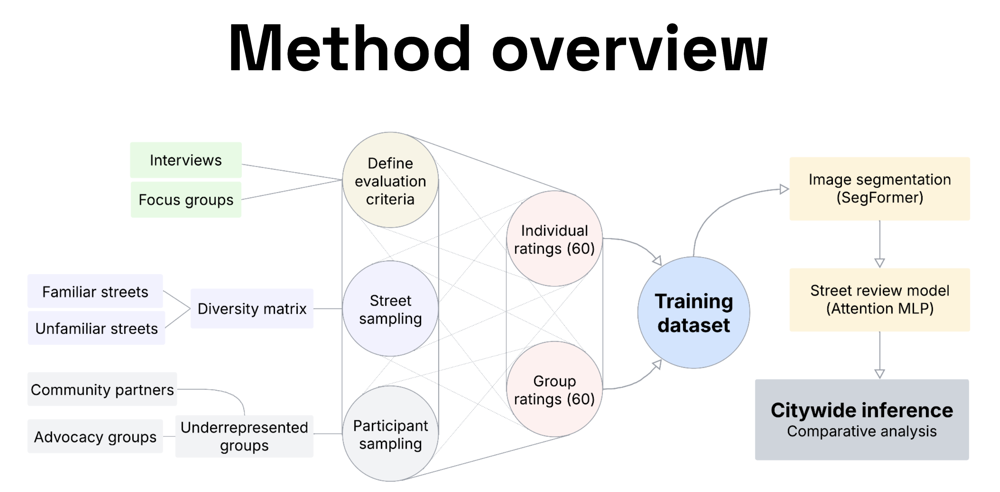
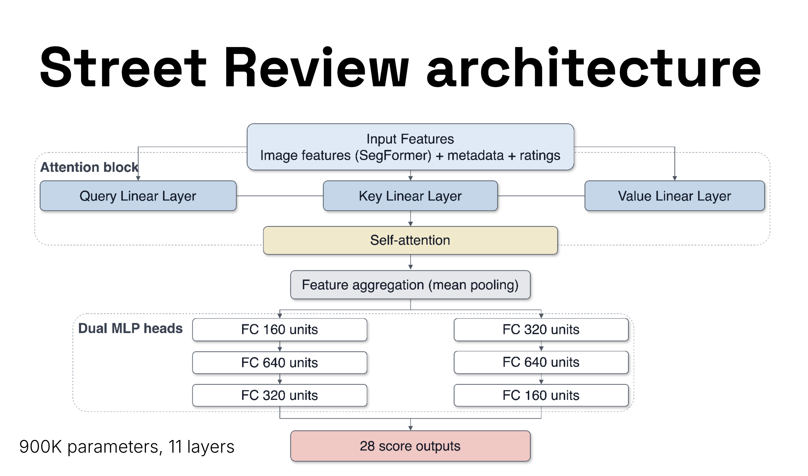
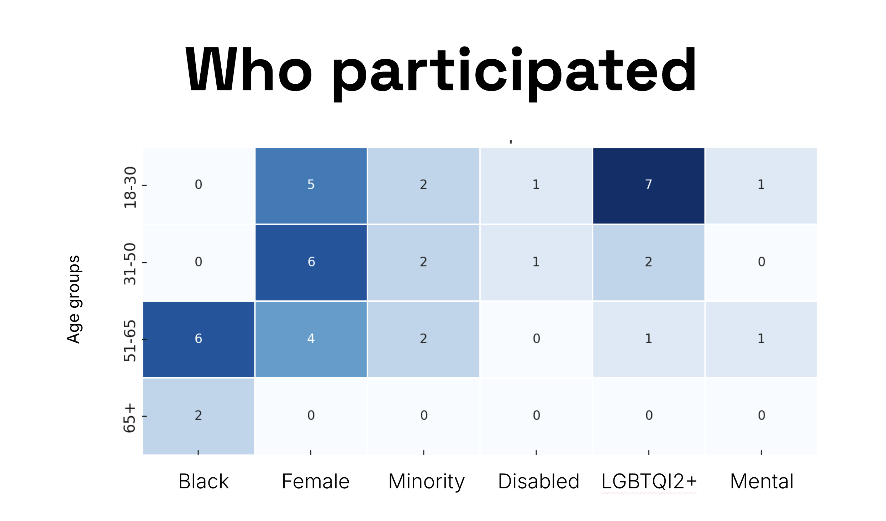
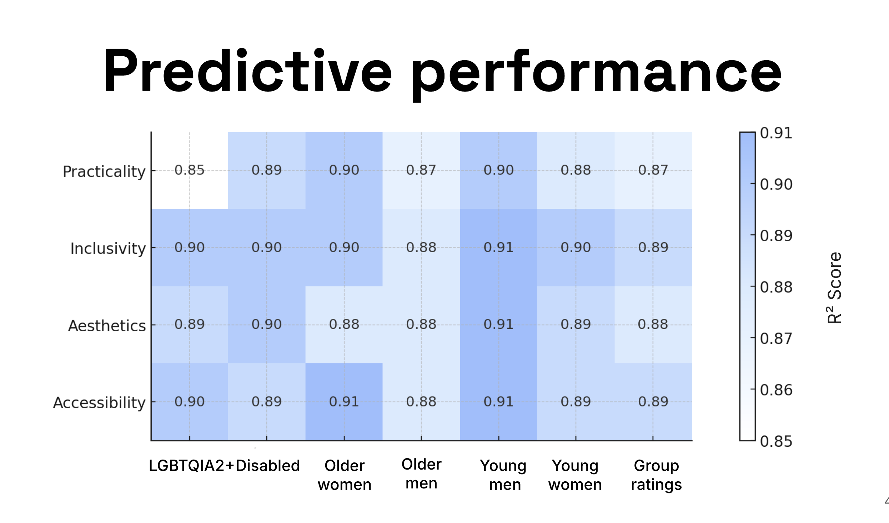
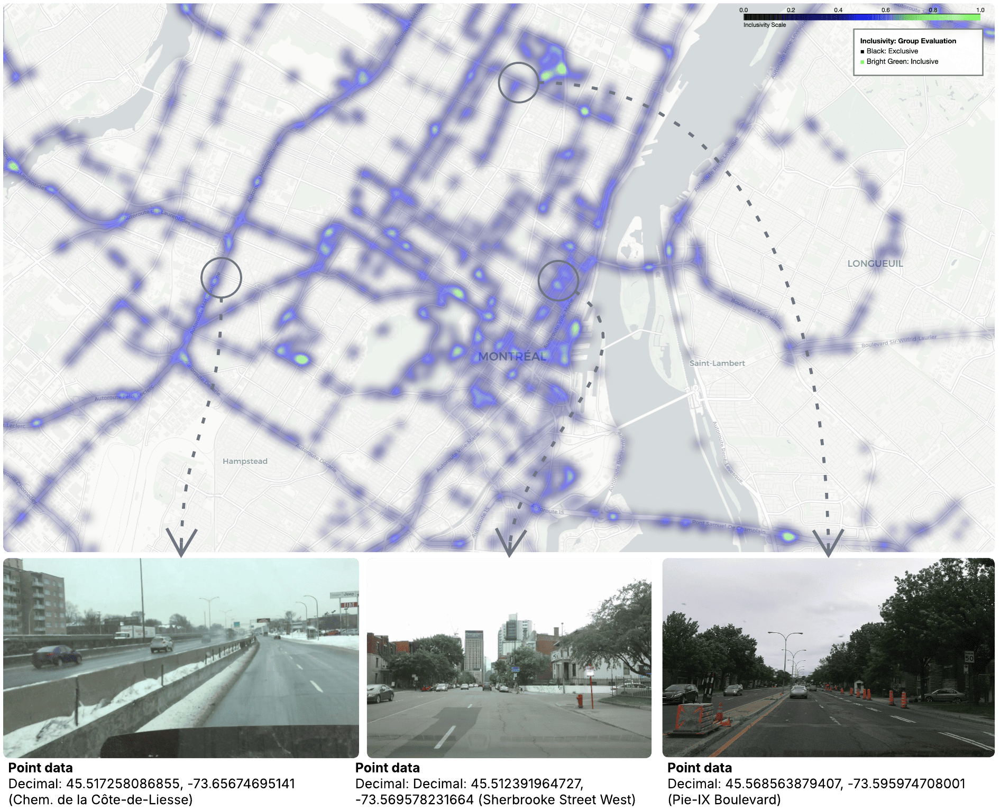

*This version of Street Review asks what happens when community judgment is paired with city-scale image analysis instead of being left as a one-off workshop insight (Mushkani & Koseki, 2026).*

[Read in Cities / ScienceDirect](https://www.sciencedirect.com/science/article/pii/S0264275125009059) · [View Dataset on Hugging Face](https://huggingface.co/datasets/rsdmu/streetreview)

## Why I Took The Method Further

The original Street Review framework showed that people do not read the same street in the same way, and that group discussion can surface those differences with more precision than isolated scoring alone (Mushkani & Koseki, 2025). The next question was scale: could those situated judgments be connected to recurring streetscape patterns across a whole city without flattening the people who produced them (Mushkani & Koseki, 2026)?

That is the problem this project addresses. It combines participatory evaluation with AI-based image analysis so planners can ask not only whether a street functions, but who feels included, who does not, and which physical features seem to shape those differences (Mushkani & Koseki, 2026).

## What The Study Did

In Montréal, the published study combined semi-directed interviews and image evaluations with 28 residents and the analysis of roughly 45,000 street-view images from Mapillary (Mushkani & Koseki, 2026). The resulting workflow linked community judgments about **inclusivity** and **accessibility** to visible street features such as sidewalks, maintenance, greenery, seating, and building conditions, then translated those relationships into heatmaps and comparative model outputs (Mushkani & Koseki, 2026).

What makes that useful is not that the model replaces public judgment. It does the opposite. The model is only legible because community participants first defined what mattered and how those values should be read in the image data (Mushkani & Koseki, 2026).

## What It Found

The study found meaningful variation across participant groups in how streets were judged, reinforcing the idea that these differences are not noise but part of what inclusive planning has to understand (Mushkani & Koseki, 2026). One finding is that **sidewalk and building quality outweighed greenery alone** in shaping perceived inclusivity, which pushes back against urban rhetoric that treats planting as a substitute for broader spatial care (Mushkani & Koseki, 2026).

Just as important, the framework showed that demographic-specific heatmaps can reveal where streets feel different to different publics instead of collapsing those perspectives into one city average (Mushkani & Koseki, 2026).

## Why It Matters

For planners and policy teams, the value of this work is its combination of scale and specificity. It offers repeatable analysis without pretending that public experience is singular. For me, that is the promise of participatory AI in cities: not automation for its own sake, but better ways of seeing where a city's official story about inclusion diverges from what residents actually live (Mushkani & Koseki, 2025, 2026).

## Visuals

*From participatory evaluation to model outputs.*

*How community-defined indicators connect to image analysis.*

*Participant profile overview.*

*Comparative model performance across indicators.*

*Spatial patterning of perceived inclusivity across sampled Montréal locations.*

**More:** [Cities / ScienceDirect](https://www.sciencedirect.com/science/article/pii/S0264275125009059) · [DOI](https://doi.org/10.1016/j.cities.2025.106602) · [Street Review dataset](https://huggingface.co/datasets/rsdmu/streetreview)

## References

Mushkani, R., & Koseki, S. (2025). *Intersecting perspectives: A participatory street review framework for urban inclusivity*. Habitat International, 164, 103536. https://doi.org/10.1016/j.habitatint.2025.103536

Mushkani, R., & Koseki, S. (2026). *Street review: A participatory AI-based framework for assessing streetscape inclusivity*. Cities, 170, 106602. https://doi.org/10.1016/j.cities.2025.106602
