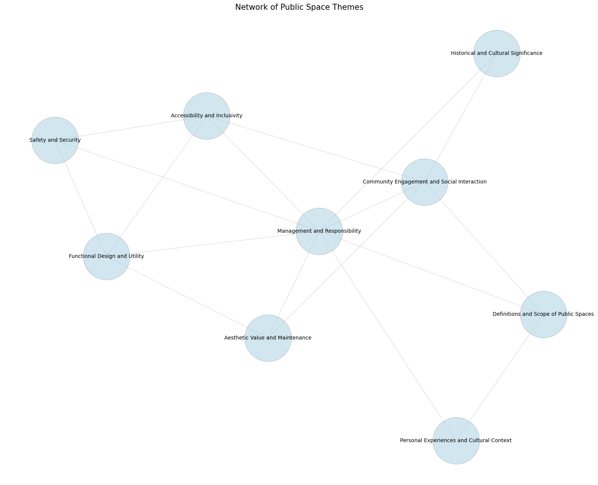

## Context and Problem

Public spaces are more than just physical locations; they serve as platforms where diverse communities intersect, interact, and share experiences. As cities strive to design inclusive and accessible environments, understanding how different citizens perceive and utilize these spaces is crucial. Without tools that capture a broad range of perspectives—across lines of ability, identity, culture, and background—urban planners risk overlooking critical factors that foster or hinder equitable usage.

In Montreal, a participatory research project engaged 15 citizens representing various identities—LGBTQ+, elderly, disabled individuals, and people from different racial and gender backgrounds. Through interviews and focus groups, these participants shared their insights on what makes public spaces welcoming, functional, and meaningful. This qualitative data was then analyzed to reveal nuanced layers of design, usage, and perception.

## Project Objectives

- **Capture Diverse Perspectives:** Gather qualitative input from participants of varied identities to understand the rich tapestry of public space usage.
- **Identify Core Themes:** Extract recurring themes and concepts that influence public space inclusivity, aesthetics, functionality, and safety.
- **Visualize Connections:** Use data visualization tools to represent the complex relationships between ideas, supporting urban planners in making informed decisions.

## Methodology

1. **Data Collection (Interviews and Focus Groups):**  
   Conducted semi-structured interviews and focus groups with 15 citizens in Montreal. The participants discussed their experiences, preferences, and concerns related to public spaces, providing a spectrum of viewpoints.

2. **Transcription and Analysis:**  
   Conversations were transcribed and analyzed using the open-source Mistral 32B language model. This allowed the extraction of recurring themes, concepts, and keywords central to understanding inclusivity and usability in public spaces.

3. **Data Visualization:**  
   From the analyzed data, key themes and concepts were organized into visual networks. Two main visualizations were produced:
   
   - **Thematic Network:** Illustrates high-level categories such as accessibility, safety, community engagement, aesthetics, cultural significance, functional design, and management.
   - **Conceptual Network (Detailed Keywords):** Depicts a dense web of specific concepts, revealing intricate interconnections and the frequency of mentions.

## Results and Visualizations

### Thematic Network

The below visualization provides a high-level thematic map. It highlights seven critical categories:

- **Accessibility and Inclusivity**
- **Safety and Security**
- **Community Engagement and Social Interaction**
- **Aesthetic Value and Maintenance**
- **Historical and Cultural Significance**
- **Functional Design and Utility**
- **Management and Responsibility**

These themes demonstrate that public spaces operate as dynamic ecosystems influenced by multifaceted factors. The interplay among these categories shapes how residents perceive and engage with the urban environment.

### Conceptual Network Visualization

The second visualization, represented by a dense network of nodes and links, showcases the detailed concepts and keywords extracted from participants' discussions. Each node represents a concept—such as adaptability, welcoming atmosphere, practicality, safety, funding, maintenance, socio-economic impact, or diversity of use—while node size correlates with frequency of mention. Links between nodes illustrate how ideas relate and cluster around core principles shaping public space experiences.

**Explore the detailed conceptual network visualization [here](https://mid-spaces.github.io/landing-page/nodesplot.html).**

## Interpretation and Impact

These visualizations underscore the importance of participatory approaches in urban design. By centering the voices of diverse citizens, planners and policymakers can identify which attributes genuinely matter to the community. The thematic and conceptual networks serve as roadmaps, guiding the creation of public spaces that reflect local values and respond to the nuanced needs of all users.

## Future Directions

- **Refined Analysis:** Continue refining data analysis techniques to capture even deeper insights from expanded participant groups.
- **Policy Integration:** Incorporate these findings into policy guidelines and urban planning frameworks that prioritize inclusivity.
- **Public Engagement Platform:** Develop a digital platform that allows ongoing community input, visualization updates, and iterative design processes.

## Related Links

- [University of Montreal](https://www.umontreal.ca/)
- [Mila - Quebec AI Institute](https://mila.quebec/en)
- [UNESCO Chair in Urban Landscape](https://unesco-studio.umontreal.ca/)

## Tags

  Public Spaces
  Citizen Participation
  Data Visualization
  Inclusive Urban Design
  Montreal

