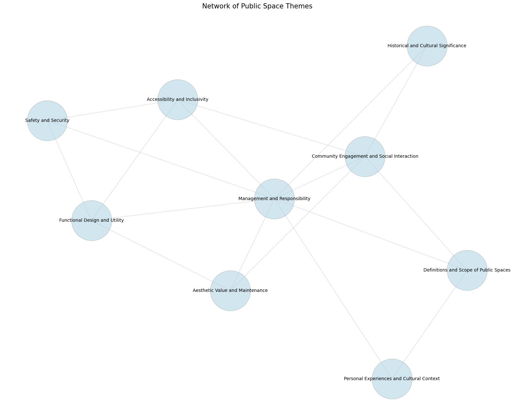

*Before I asked models to classify streets, I needed to understand the language residents already used to describe public space, because that language is part of the evidence too (Gowaikar et al., 2024; Mushkani & Koseki, 2025).*

## Why This Work Matters

The early Montréal work showed that public-space evaluation is never only about form. People talk about welcome, safety, belonging, maintenance, memory, and everyday usability in ways that are shaped by identity and lived experience, and those meanings need to be heard before they can be translated into datasets or models.

## How The Visualizations Worked

This exploratory phase relied on interviews and group conversations to map recurring ideas in how residents described public space in Montréal. The thematic and conceptual network diagrams were a way of making those qualitative patterns visible before turning them into more structured evaluation criteria and image-based assessment tasks (Gowaikar et al., 2024; Mushkani et al., 2025).

What mattered was not only which words appeared, but how they clustered. Concerns about accessibility, safety, aesthetics, practicality, management, and social interaction were not separate boxes. They overlapped, reinforced one another, and sometimes pulled in different directions, which is part of why later participatory street studies found disagreement to be analytically useful rather than methodologically inconvenient (Mushkani & Koseki, 2025).

## Why The Networks Still Matter

These visualizations helped make one point visible: public-space design is also a problem of public meaning. If planning tools cannot register what people mean when they describe care, exclusion, comfort, or disorder, they miss much of the social life of the place they are supposed to improve. Later published work on Montréal streets confirmed that inclusive evaluation becomes stronger when residents can first describe and then collectively deliberate what they are seeing (Mushkani et al., 2025).

*A thematic map of recurring ideas in residents' descriptions of public space.*

## Explore The Network

[Detailed conceptual network visualization](https://mid-spaces.github.io/landing-page/nodesplot.html)

## References

Gowaikar, S., Berard, H., Mushkani, R., Beaudry Marchand, E., Ammar, T., & Koseki, S. (2024). *AI-EDI-SPACE: A co-designed dataset for evaluating the quality of public spaces*. arXiv. https://doi.org/10.48550/arXiv.2411.00956

Mushkani, R., & Koseki, S. (2025). *Intersecting perspectives: A participatory street review framework for urban inclusivity*. Habitat International, 164, 103536. https://doi.org/10.1016/j.habitatint.2025.103536

Mushkani, R., Berard, H., Ammar, T., & Koseki, S. (2025). *Public perceptions of Montréal's streets: Implications for inclusive public space making and management*. Journal of Urban Management, Advance online publication. https://doi.org/10.1016/j.jum.2025.07.004
