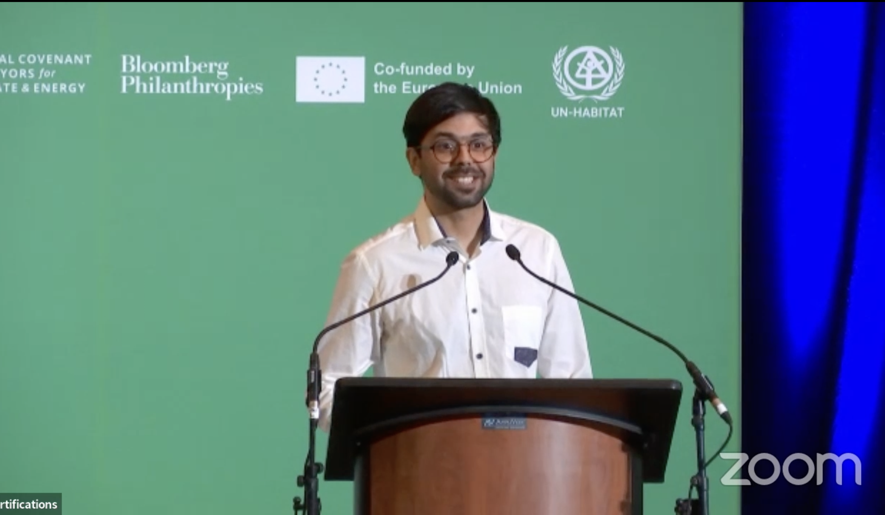

## Lecture Overview

**Presenter:** Rashid Mushkani  
**Affiliation:** Doctoral Candidate, University of Montreal  
**Conference:** Innovate for Cities 2024

[Watch the Lecture on YouTube](https://www.youtube.com/watch?v=xYRY7WdzVMk&t=437s)

## Problem

Public spaces in cities were primarily designed in the mid-20th century, often not accommodating the diverse and evolving needs of today’s populations. Challenges such as global warming and increased urban diversity necessitate a reevaluation of how inclusive these spaces are for all community members, including the elderly, disabled, minority groups, women, and LGBTQ+ individuals.

## Project Objectives

- **Assess Inclusivity:** Develop AI models to evaluate the inclusiveness of public spaces.
- **Design Enhancement:** Utilize generative AI to create conceptual designs that align with the specific context of Montreal.
- **Community Engagement:** Involve diverse citizen groups in the assessment and design process to ensure public spaces meet varied needs.

## Methodology

### Predictive AI Model

A predictive AI model was developed to assess the qualities of public spaces. This model was trained on approximately 60 data points and achieved around 90% accuracy in predicting inclusivity based on various spatial elements such as sidewalk construction and surrounding buildings.

### Generative AI Model

A generative AI model was created to produce direct conceptual designs for public spaces. This model generates designs that are fine-tuned to the context of Montreal, facilitating the visualization of inclusive and functional urban environments.

### Community Workshops

Workshops were conducted with 20 participants from diverse backgrounds, including elderly, disabled, minority, women, and LGBTQ+ communities. These sessions helped formulate AI prompts and ensure that the models reflect the perspectives of different user groups.

## Results and Impact

The predictive AI model successfully identified inclusive and exclusive spaces, providing heat maps that highlight areas in Montreal needing improvement. The generative AI model produced nuanced visualizations of public spaces that cater to diverse community needs. These tools offer valuable insights for urban planners to make informed decisions, enhancing the inclusivity and functionality of public spaces.

## Future Directions

- **Platform Development:** Create a user-friendly platform to facilitate public consultations, allowing citizens to visualize and contribute to the design of their neighborhoods.
- **Data Expansion:** Increase the dataset with more images to improve AI model accuracy and reduce biases.
- **Partnerships and Funding:** Seek collaborations and funding to pilot the platform and expand the project’s reach.

## Related Links

- [Innovate4Cities](https://www.innovate4cities.org/livesteam2024/)
- [University of Montreal](https://www.umontreal.ca/)
- [Mila - Quebec AI Institute](https://mila.quebec/en)
- [AIAI, Mila - Quebec AI Institute](https://mila.quebec/en/ai4humanity/applied-projects/artificial-intelligence-alignment-for-inclusion-aiai)
- [UNESCO Chair in Urban Landscape](https://unesco-studio.umontreal.ca/)

## Tags

  Artificial Intelligence
  Urban Planning
  Inclusivity
  Community Engagement
  Public Spaces

