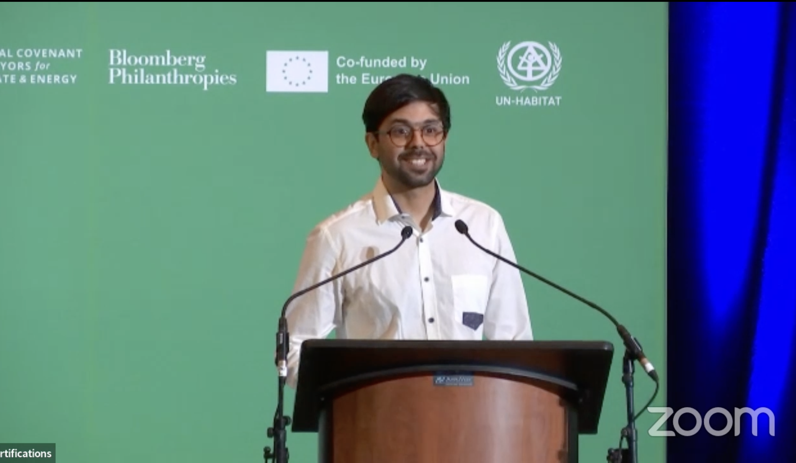

*This talk brought a research argument into a public forum: AI can help cities only if residents help define what the system measures, compares, and imagines (Gowaikar et al., 2024; Nayak et al., 2024).*

## Lecture Overview

This lecture was presented at Innovate4Cities 2024 in Montréal (Innovate4Cities, 2024). Rather than presenting AI as a shortcut to urban design, the talk argued for another role: AI as a civic aid that can help residents and planners compare streets, surface trade-offs, and imagine alternatives without taking judgment away from the public.

[Watch the Lecture on YouTube](https://www.youtube.com/watch?v=xYRY7WdzVMk&t=437s)

## What The Talk Covered

The lecture brought together three linked strands of work from Montréal: co-designed public-space evaluation, participatory image generation, and street-level assessment methods that later matured into Street Review (Mushkani & Koseki, 2025). In each strand, the core claim was the same: inclusion cannot be reduced to a visual style or a fixed metric, because different people read the same space differently and those differences need to shape the system from the start.

The talk therefore focused less on technological spectacle than on method. Workshops, co-designed criteria, and public comparison tasks were presented as the infrastructure that makes AI analysis more trustworthy, not as optional community add-ons attached to an otherwise technical pipeline (Gowaikar et al., 2024; Nayak et al., 2024).

## Why The Talk Mattered

At a conference devoted to cities and climate action, the argument was that inclusive public-space design is also a question of data, representation, and voice. If the systems used to assess or visualize urban futures are built around narrow assumptions, they reproduce exclusion in polished form; if they are built with plural publics in view, they can become tools for better questions and more accountable decisions (Innovate4Cities, 2024; Mushkani & Koseki, 2025).

## References

Gowaikar, S., Berard, H., Mushkani, R., Beaudry Marchand, E., Ammar, T., & Koseki, S. (2024). *AI-EDI-SPACE: A co-designed dataset for evaluating the quality of public spaces*. arXiv. https://doi.org/10.48550/arXiv.2411.00956

Innovate4Cities. (2024). *Live stream: 2024 Innovate4Cities Conference*. https://www.innovate4cities.org/livesteam2024/

Mushkani, R., & Koseki, S. (2025). *Intersecting perspectives: A participatory street review framework for urban inclusivity*. Habitat International, 164, 103536. https://doi.org/10.1016/j.habitatint.2025.103536

Nayak, S., Mushkani, R., Berard, H., Cohen, A., Koseki, S., & Bertrand, H. (2024). *MID-Space: Aligning diverse communities' needs to inclusive public spaces*. OpenReview. https://openreview.net/forum?id=kyfkMRT4Ao
