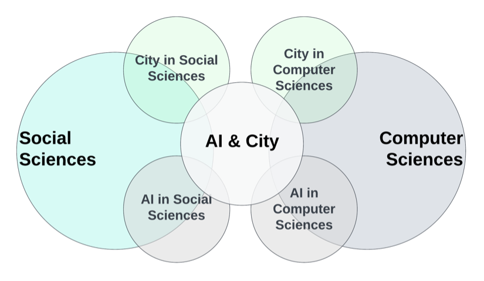

## Problem

Intersectoral research combining **Artificial Intelligence (AI)**, **social sciences**, and **urban planning** is crucial for tackling complex urban challenges like climate change and public health. However, ensuring the **validity** of knowledge across these diverse fields is difficult due to different **epistemic** and **ontological** frameworks. Traditional metrics often fall short in capturing the interdisciplinary nature, leading to lower funding success and challenges in maintaining credibility and relevance.

*Figure 1. City and AI connecting social and computer sciences.*

## Method

We reviewed the most cited papers from **2014 to 2024** across AI, social sciences, and urban planning. The analysis focused on six dimensions:

1. **Ontological**
2. **Epistemological**
3. **Methodological**
4. **Teleological**
5. **Axiological**
6. **Valorization**

Based on this, we developed a **validation framework** to guide researchers in selecting appropriate methodologies and epistemologies. The framework was tested through **case studies** and refined with input from experts in each field.

## Findings

Our framework categorizes perspectives within the six dimensions, promoting a structured approach to validate intersectoral studies:

  1. **Ontological:** Defining reality in city science and AI.
  2. **Epistemological:** Understanding knowledge scope in interdisciplinary research.
  3. **Methodological:** Choosing methods that integrate AI, social sciences, and urban planning.
  4. **Teleological:** Aligning research with societal needs.
  5. **Axiological:** Incorporating values and ethics.
  6. **Valorization:** Ensuring practical impact.

## Interactive Visualization
**Explore the detailed concepts [here](https://mid-spaces.github.io/landing-page/network.html).**

## Impact

This framework bridges disciplinary silos, enhancing the **credibility** and **relevance** of intersectoral research in city science. It provides a clear guide for researchers to adopt or avoid certain perspectives, ensuring **socially accountable knowledge**. Future steps include testing the framework in other domains, expanding stakeholder engagement, integrating with policy development, and developing educational programs.

## Related Links

- [University of Montreal](https://www.umontreal.ca/)
- [Mila - Quebec AI Institute](https://mila.quebec/en)
- [UNESCO Chair in Urban Landscape](https://unesco-studio.umontreal.ca/)

## Tags

  Artificial Intelligence
  Urban Planning
  Intersectoral Reserach
  Knowledge Validation
  City Science

