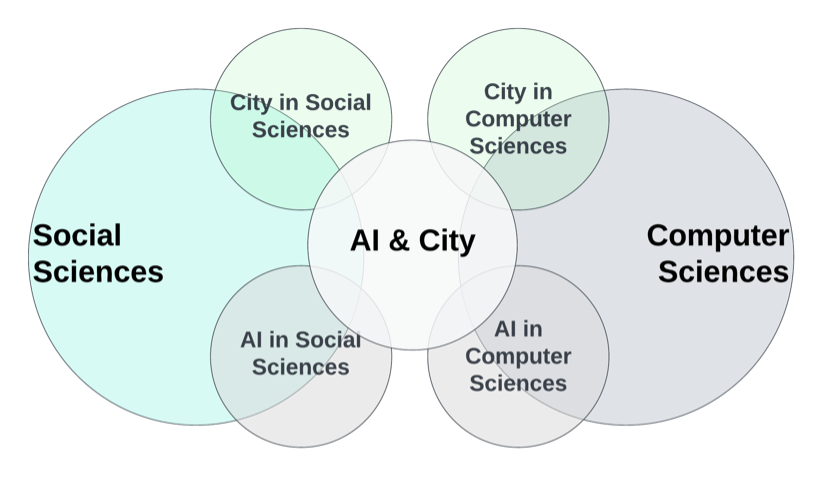

*Interdisciplinary work often breaks down not because the questions are weak, but because nobody agrees on what counts as valid knowledge.*

## Why This Matters

Research that combines **artificial intelligence**, **social science**, and **urban planning** is essential for questions such as climate adaptation, public health, and urban inequality. It is also notoriously hard to evaluate. Each field brings different assumptions about reality, evidence, method, purpose, and value.

I wanted a clearer way to judge whether interdisciplinary work in city science was genuinely rigorous, rather than merely fashionable.

*Figure 1. City and AI connecting social and computer sciences.*

## What I Reviewed

I reviewed highly cited papers from **2014 to 2024** across AI, the social sciences, and urban planning. The analysis focused on six dimensions:

- **Ontological:** what kind of reality the research assumes
- **Epistemological:** what counts as knowledge and whose knowledge matters
- **Methodological:** how the work gathers and validates evidence
- **Teleological:** what the research is for
- **Axiological:** what values and ethical commitments shape it
- **Valorization:** how the work produces public or practical value

From that review, I developed a validation framework to help researchers choose methods and epistemologies more deliberately. I then tested the framework through case studies and refined it with expert input from each field.

## What the Framework Does

The framework does not try to erase disciplinary difference. It makes that difference explicit. It gives researchers a structured way to ask whether their assumptions, methods, goals, and claims actually fit together.

In practice, that means more credible interdisciplinary work and a clearer route toward socially accountable knowledge in city science.

## Explore the Framework

[Interactive concept map](https://mid-spaces.github.io/landing-page/network.html)

*Tags: Artificial Intelligence · Urban Planning · Intersectoral Research · Knowledge Validation · City Science*
